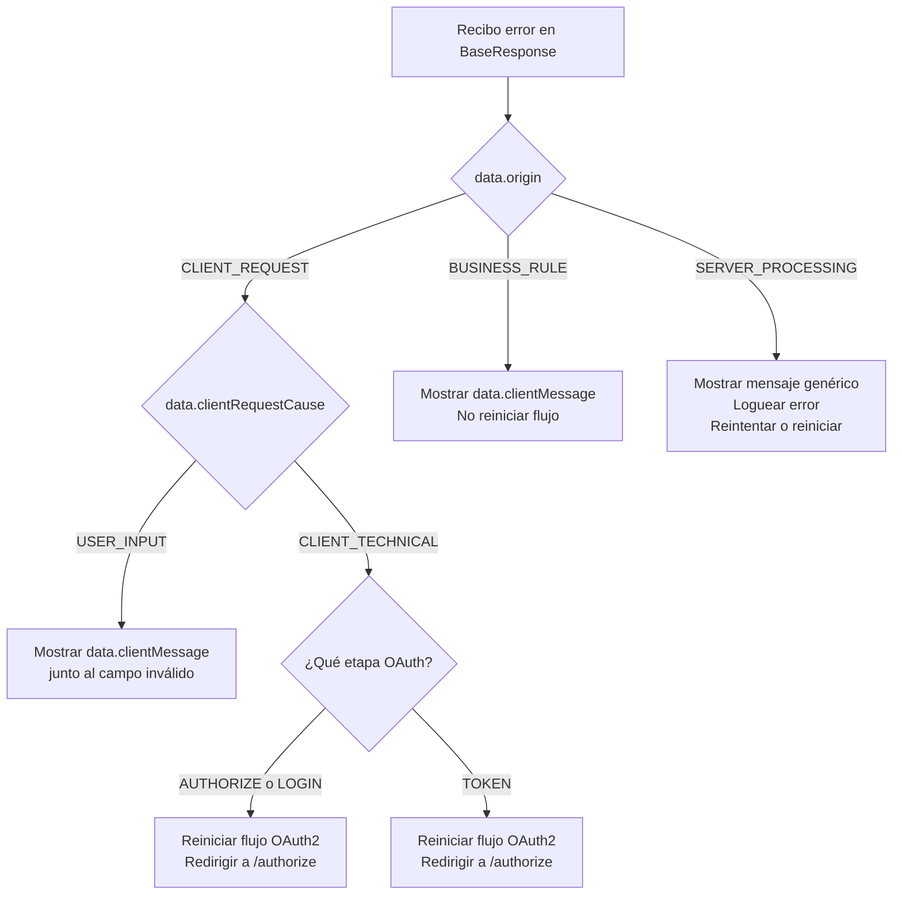

# ADR-001 — Clasificación de errores OAuth2 con `ErrorData`

| Campo | Valor |
|---|---|
| **ID** | ADR-001 |
| **Título** | Clasificación canónica de errores en flujos OAuth2 mediante `ErrorData` |
| **Estado** | ✅ Aceptado |
| **Fecha** | 2026-03-26 |
| **Autor** | Equipo KeyGo |
| **Contexto** | Frontend integration — flujos `AUTHORIZE → LOGIN → TOKEN` |

---

## 1. Contexto

El servidor KeyGo expone un flujo OAuth2 Authorization Code + PKCE a través de tres etapas:

1. `GET /api/v1/tenants/{slug}/oauth2/authorize` — inicio del flujo
2. `POST /api/v1/tenants/{slug}/account/login` — autenticación del usuario
3. `POST /api/v1/tenants/{slug}/oauth2/token` — intercambio de código por tokens

Históricamente, los errores se devolvían solo con `failure.message` (string genérico), sin metadatos
que permitiesen al frontend distinguir si el error requería acción del usuario, de la UI o era un
fallo del servidor.

---

## 2. Decisión

**Todo error en `BaseResponse<T>` que provenga de una excepción manejada incluirá un campo `data`
de tipo `ErrorData` con metadatos de clasificación.**

### 2.1 Estructura `ErrorData` (Java backend)

```java
// keygo-api/src/main/java/io/cmartinezs/keygo/api/error/ErrorData.java
public class ErrorData {
  String code;               // código interno (ej. "ERR-009")
  ApiErrorOrigin origin;     // categoría del error
  ApiClientRequestCause clientRequestCause; // sub-categoría (solo si origin=CLIENT_REQUEST)
  String clientMessage;      // mensaje en español, listo para mostrar al usuario
  String detail;             // detalle técnico (solo en dev/debug)
  String exception;          // nombre de la excepción (solo en dev/debug)
}
```

### 2.2 Enumeraciones canónicas

#### `ApiErrorOrigin`

| Valor | Significado | ¿Quién tiene la culpa? |
|---|---|---|
| `CLIENT_REQUEST` | El request enviado es inválido o incompleto | Frontend o usuario |
| `BUSINESS_RULE` | El servidor rechaza la operación por una regla de negocio | Estado del sistema |
| `SERVER_PROCESSING` | Error inesperado al procesar la operación | Backend |

#### `ApiClientRequestCause` (solo cuando `origin = CLIENT_REQUEST`)

| Valor | Significado | Ejemplo |
|---|---|---|
| `USER_INPUT` | El usuario ingresó datos incorrectos | Contraseña inválida, email mal formado |
| `CLIENT_TECHNICAL` | La UI envió un request técnicamente incorrecto | Cookie ausente, parámetro PKCE faltante |

---

## 3. Alternativas consideradas

| Alternativa | Motivo de descarte |
|---|---|
| Usar solo `failure.message` (estado anterior) | No distingue origen del error; obliga al frontend a parsear strings o usar códigos HTTP como proxy |
| Usar HTTP status codes como clasificación (4xx/5xx) | No distingue `USER_INPUT` de `CLIENT_TECHNICAL`, ambos son 400/401 |
| Lanzar errores diferenciados con body libre | Rompe el contrato `BaseResponse<T>`; complica el manejo homogéneo en el frontend |

---

## 4. Consecuencias

### ✅ Positivas

- El frontend toma decisiones de UX sin parsear mensajes de texto.
- `clientMessage` elimina la necesidad de un catálogo de traducción en la UI para errores comunes.
- La distinción `USER_INPUT` / `CLIENT_TECHNICAL` permite mostrar errores de validación al usuario
  vs. loguear y reiniciar el flujo en silencio.
- El backend mantiene el contrato uniforme — toda respuesta de error es `BaseResponse<ErrorData>`.

### ⚠️ Limitaciones conocidas

- Algunos errores técnicos del flujo OAuth2 (sesión expirada, código inválido, PKCE fallido) actualmente
  mapean a `USER_INPUT` vía `INVALID_INPUT` en lugar de `CLIENT_TECHNICAL`. Pendiente corrección
  en **T-066**.
- `clientMessage` está en español (es-MX) hardcoded. El soporte multiidioma está propuesto en **T-064**.

---

## 5. Mapa de errores por etapa OAuth2

### Paso 1 — `GET /oauth2/authorize`

| `ResponseCode` | `origin` | `clientRequestCause` | HTTP |
|---|---|---|---|
| `RESOURCE_NOT_FOUND` (tenant/app) | `CLIENT_REQUEST` | `CLIENT_TECHNICAL` | 404 |
| `BUSINESS_RULE_VIOLATION` (tenant suspendido) | `BUSINESS_RULE` | — | 422 |
| `OPERATION_FAILED` | `SERVER_PROCESSING` | — | 500 |

### Paso 2 — `POST /account/login`

| `ResponseCode` | `origin` | `clientRequestCause` | HTTP |
|---|---|---|---|
| `AUTHENTICATION_REQUIRED` (sin sesión) | `CLIENT_REQUEST` | `CLIENT_TECHNICAL` ⚠️ | 401 |
| `AUTHENTICATION_REQUIRED` (credenciales inválidas) | `CLIENT_REQUEST` | `USER_INPUT` | 401 |
| `EMAIL_NOT_VERIFIED` | `BUSINESS_RULE` | — | 422 |
| `BUSINESS_RULE_VIOLATION` | `BUSINESS_RULE` | — | 422 |
| `OPERATION_FAILED` | `SERVER_PROCESSING` | — | 500 |

### Paso 3 — `POST /oauth2/token`

| `ResponseCode` | `origin` | `clientRequestCause` | HTTP |
|---|---|---|---|
| `INVALID_INPUT` (código expirado / PKCE fail) | `CLIENT_REQUEST` | `USER_INPUT` ⚠️ | 400 |
| `BUSINESS_RULE_VIOLATION` | `BUSINESS_RULE` | — | 422 |
| `OPERATION_FAILED` | `SERVER_PROCESSING` | — | 500 |

> ⚠️ Filas marcadas tienen desalineación conocida — ver T-066.

---

## 6. Árbol de decisión para el frontend



---

## 7. Contrato de respuesta de error

### JSON de error (ejemplo: credenciales inválidas)

```json
{
  "date": "2026-03-26T12:00:00Z",
  "failure": {
    "message": "Authentication required",
    "code": "ERR-009"
  },
  "data": {
    "code": "ERR-009",
    "origin": "CLIENT_REQUEST",
    "clientRequestCause": "USER_INPUT",
    "clientMessage": "No pudimos validar tu sesión. Inicia sesión nuevamente."
  }
}
```

### Tipos TypeScript

```typescript
type ErrorOrigin = 'CLIENT_REQUEST' | 'BUSINESS_RULE' | 'SERVER_PROCESSING';
type ClientRequestCause = 'USER_INPUT' | 'CLIENT_TECHNICAL';

interface ErrorData {
  code: string;
  origin: ErrorOrigin;
  clientRequestCause?: ClientRequestCause;   // solo si origin === 'CLIENT_REQUEST'
  clientMessage: string;                     // mensaje listo para mostrar al usuario
  detail?: string;                           // solo en entornos dev/debug
  exception?: string;                        // solo en entornos dev/debug
}
```

---

## 8. Helper de referencia (TypeScript)

```typescript
type AuthStage = 'AUTHORIZE' | 'LOGIN' | 'TOKEN';

type AuthErrorAction =
  | 'SHOW_FIELD_ERROR'        // USER_INPUT → mostrar junto al campo
  | 'SHOW_BUSINESS_MESSAGE'   // BUSINESS_RULE → mostrar como alerta
  | 'RESTART_OAUTH_FLOW'      // CLIENT_TECHNICAL o SERVER → reiniciar flujo
  | 'SHOW_SERVER_ERROR';      // SERVER_PROCESSING grave

function resolveAuthError(
  error: ErrorData,
  stage: AuthStage
): AuthErrorAction {
  if (error.origin === 'CLIENT_REQUEST') {
    if (error.clientRequestCause === 'USER_INPUT') return 'SHOW_FIELD_ERROR';
    return 'RESTART_OAUTH_FLOW';
  }
  if (error.origin === 'BUSINESS_RULE') return 'SHOW_BUSINESS_MESSAGE';
  if (stage === 'TOKEN') return 'RESTART_OAUTH_FLOW';
  return 'SHOW_SERVER_ERROR';
}
```

---

## 9. Propuestas de evolución

| ID | Horizonte | Descripción |
|---|---|---|
| **T-065** | Corto plazo | Agregar `fieldErrors: string[]` a `ErrorData` cuando `clientRequestCause=USER_INPUT` |
| **T-066** | Mediano plazo | Reclasificar sesión expirada / PKCE / código inválido a `CLIENT_TECHNICAL`; agregar `endpointHint` |
| **T-064** | Largo plazo | Catálogo i18n de `clientMessage` por dominio (`auth`, `tenant`, `membership`) |

---

## 10. Archivos de referencia

| Archivo | Descripción |
|---|---|
| `keygo-api/.../error/ErrorData.java` | Estructura Java del payload de error |
| `keygo-api/.../error/ApiErrorDataFactory.java` | Lógica de mapeo `ResponseCode → ErrorData` |
| `keygo-api/.../error/ApiErrorOrigin.java` | Enum de origen del error |
| `keygo-api/.../error/ApiClientRequestCause.java` | Enum de causa en errores de cliente |
| `keygo-api/.../error/GlobalExceptionHandler.java` | Mapeo de excepciones a HTTP + ErrorData |
| `docs/api/AUTH_FLOW.md` | Flujo OAuth2 completo con tablas de errores por paso |
| `docs/keygo-ui/FRONTEND_DEVELOPER_GUIDE.md` | Guía frontend: tipos TS, ejemplos, playbook §14.1.2 |

