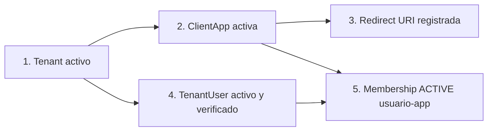
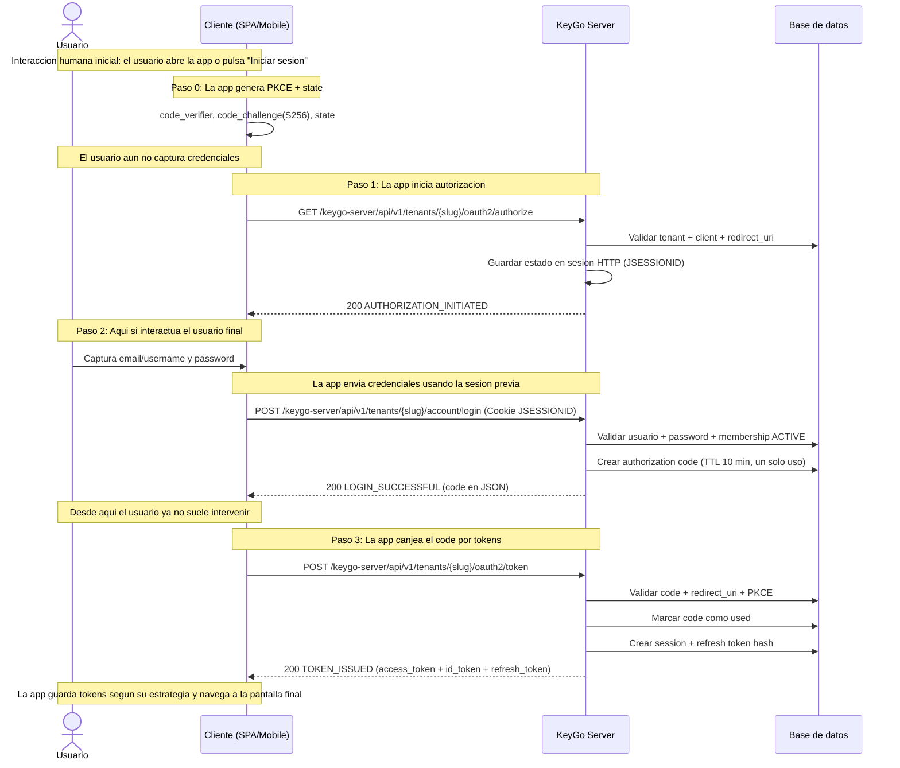
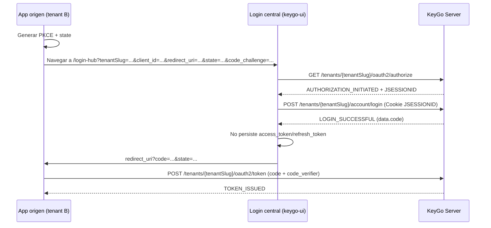
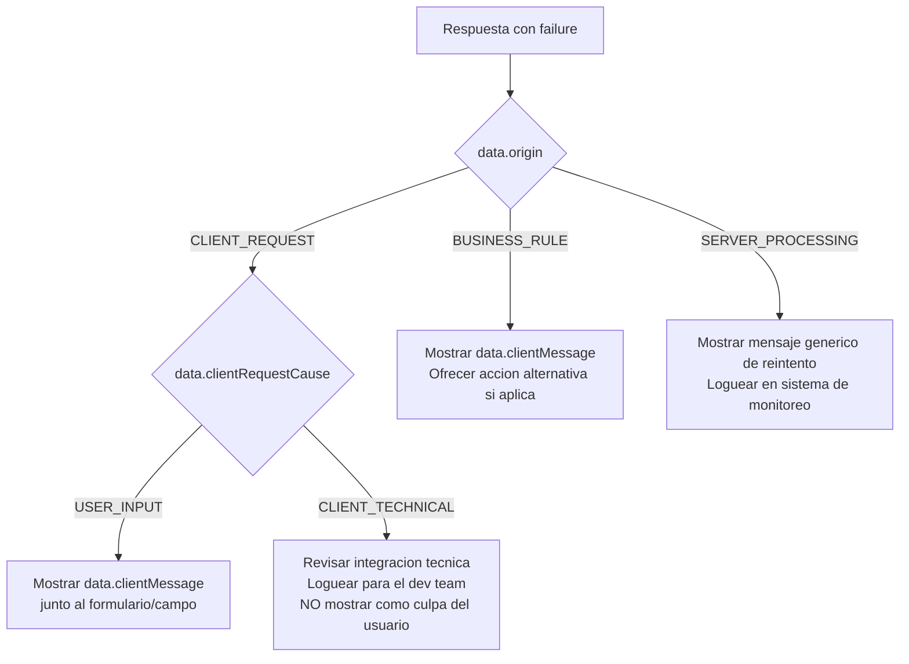

# Flujo de Autenticacion — KeyGo Server

> Guia de referencia del flujo OAuth2/OIDC implementado actualmente en KeyGo Server para clientes SPA, mobile y server-to-server.
>
> Fecha de actualizacion: **2026-03-26** | Estado: **Fases 5, 6, 7, 8 y 9b implementadas**

---

## Tabla de contenidos

1. [Resumen ejecutivo](#resumen-ejecutivo)
2. [Prerrequisitos del sistema](#prerrequisitos-del-sistema)
3. [Seguridad de endpoints (publico vs protegido)](#seguridad-de-endpoints-publico-vs-protegido)
4. [Flujo principal: Authorization Code + PKCE](#flujo-principal-authorization-code--pkce)
5. [Escenario recomendado: login central (KeyGo-UI) para multiples tenants](#escenario-recomendado-login-central-keygo-ui-para-multiples-tenants)
6. [Endpoint de tokens: grants soportados](#endpoint-de-tokens-grants-soportados)
7. [Manejo de errores](#manejo-de-errores)
8. [Checklist para clientes](#checklist-para-clientes)
9. [Referencias cruzadas](#referencias-cruzadas)

---

## Resumen ejecutivo

KeyGo Server implementa el flujo **OAuth 2.0 Authorization Code + PKCE** como flujo principal para usuarios finales, y tambien soporta **refresh token rotation** y **client_credentials** para M2M.

| Caracteristica | Estado actual |
|---|---|
| Authorization Code + PKCE | Implementado |
| Login con sesion HTTP intermedia (JSESSIONID) | Implementado |
| Access token JWT RS256 | Implementado |
| ID token (OIDC) | Implementado |
| Refresh token (emision + rotacion) | Implementado |
| Client Credentials (M2M) | Implementado |
| Revocacion de token (`/oauth2/revoke`) | Implementado |
| OIDC Discovery + JWKS + UserInfo | Implementado |

Notas relevantes del estado actual:
- El `grant_type` en `POST /oauth2/token` es opcional; si no se envia, el backend asume `authorization_code`.
- `POST /account/login` **retorna el authorization code en JSON** (`BaseResponse<LoginData>`), no hace redirect `302`.
- El `context-path` activo es `/keygo-server`; todas las URLs deben incluirlo.

### ¿Cuando interactua realmente el usuario final?

En este flujo hay **tres actores distintos** que conviene no mezclar:

| Actor | Rol en el flujo | Ejemplos en KeyGo actual |
|---|---|---|
| **Usuario final** | Persona que toma decisiones y captura datos | Hace clic en "Iniciar sesion", escribe usuario/password, espera entrar a la app |
| **Cliente SPA/Mobile** | La app frontend que orquesta el flujo OAuth2 | Genera PKCE, llama `/authorize`, conserva `JSESSIONID`, llama `/account/login`, canjea el code en `/oauth2/token`, renueva tokens |
| **KeyGo Server** | Backend que valida y emite artefactos OAuth2/OIDC | Valida tenant/app/redirect URI, autentica credenciales, emite `authorization_code`, `access_token`, `id_token`, `refresh_token` |

Regla practica para leer el resto del documento:
- Si el paso habla de **capturar credenciales** o de que alguien "ve" la pantalla, la interaccion es del **usuario final**.
- Si el paso habla de **hacer requests HTTP**, **guardar PKCE**, **reenviar cookies** o **canjear tokens**, la interaccion es de la **SPA/Mobile**.
- Si el paso habla de **validar**, **persistir** o **emitir** codigos/tokens, la accion es de **KeyGo Server**.

---

## Prerrequisitos del sistema

Antes de iniciar autenticacion de usuario, deben existir y estar activos:



| Recurso | Endpoint de creacion (referencia) | Campo clave |
|---|---|---|
| Tenant | `POST /api/v1/tenants` | `slug` |
| ClientApp | `POST /api/v1/tenants/{slug}/apps` | `clientId`, `redirectUris` |
| TenantUser | `POST /api/v1/tenants/{slug}/users` | `email`, `username`, `password` |
| Membership | `POST /api/v1/tenants/{slug}/memberships` | `userId`, `clientAppId`, `roleCodes` |

---

## Seguridad de endpoints (publico vs protegido)

Con el filtro `BootstrapAdminKeyFilter` actual:

- Rutas `/api/**` estan protegidas por Bearer **excepto** ciertos sufijos/public paths.
- Estos endpoints de flujo OAuth2/OIDC son **publicos** (el filtro no exige Bearer en el borde):
  - `GET /api/v1/tenants/{tenantSlug}/oauth2/authorize`
  - `POST /api/v1/tenants/{tenantSlug}/account/login`
  - `POST /api/v1/tenants/{tenantSlug}/oauth2/token`
  - `POST /api/v1/tenants/{tenantSlug}/oauth2/revoke`
  - `GET /api/v1/tenants/{tenantSlug}/userinfo`
  - `GET /api/v1/tenants/{tenantSlug}/.well-known/openid-configuration`
  - `GET /api/v1/tenants/{tenantSlug}/.well-known/jwks.json`

> Publico en este contexto significa "sin autenticacion exigida por el filtro de borde". Algunos endpoints validan credenciales propias (por ejemplo `refresh_token`, `client_secret`, Bearer token de usuario, etc.) dentro del caso de uso/controlador.

---

## Flujo principal: Authorization Code + PKCE

Escenario: autenticacion de usuario final (SPA/mobile/web).

### Vista rapida: quien hace que en cada paso

| Paso | Usuario final | Cliente SPA/Mobile | KeyGo Server |
|---|---|---|---|
| 0. Preparacion | Aun no interactua | Genera `code_verifier`, `code_challenge` y `state` | — |
| 1. Inicio de autorizacion | Hace clic en login o entra a una ruta protegida | Llama `GET /oauth2/authorize` | Valida tenant/app/redirect URI y guarda estado en sesion HTTP |
| 2. Login | Escribe usuario/email y password | Renderiza formulario, envia `POST /account/login` y preserva `JSESSIONID` | Valida credenciales y emite `authorization_code` |
| 3. Canje del code | Ya no interactua directamente | Llama `POST /oauth2/token` con `code` + `code_verifier` | Valida code/PKCE y emite tokens |
| 4. Sesion activa | Usa la app normalmente | Adjunta Bearer token a llamadas API | Valida token en endpoints protegidos |
| 5. Renovacion | Normalmente no interactua | Llama `POST /oauth2/token` con `grant_type=refresh_token` | Rota refresh token y emite nuevos tokens |

> Punto clave: en el backend actual **el usuario final solo interactua de forma directa en el inicio de login y en la captura de credenciales**. El resto del flujo lo ejecuta la **SPA/Mobile** de forma programatica.



### Lectura funcional del flujo

1. **El usuario inicia la autenticacion desde la app**, no llamando el endpoint manualmente.
2. **La SPA/Mobile prepara el contexto tecnico** (`state`, PKCE, almacenamiento temporal y manejo de cookie de sesion).
3. **El usuario solo participa activamente en el login**: captura credenciales y confirma entrar.
4. **La SPA/Mobile retoma el control** en cuanto recibe `data.code` desde `POST /account/login`.
5. **La obtencion y renovacion de tokens es responsabilidad del cliente**, no del usuario final.

### Particularidad importante del backend actual

En una implementacion OAuth2 "clasica" con login hospedado, el navegador suele terminar en un `302` hacia la `redirect_uri`.
En **KeyGo Server hoy no ocurre eso**:

- `GET /oauth2/authorize` devuelve `200` con datos de la app cliente.
- `POST /account/login` devuelve `200` con `data.code` en JSON.
- Por lo tanto, la **SPA/Mobile** debe decidir que hacer con ese `code`:
  - canjearlo de inmediato en `POST /oauth2/token`, o
  - navegar manualmente a su callback si quiere modelar una UX mas parecida al redirect tradicional.

Esto explica por que, al leer el flujo, puede parecer ambiguo "quien interactua":
- **el usuario** interactua con la interfaz visual;
- **la SPA/Mobile** interactua con los endpoints OAuth2;
- **KeyGo** solo responde a las llamadas del cliente y aplica validaciones/reglas.

---

## Escenario recomendado: login central (KeyGo-UI) para multiples tenants

Este escenario aplica cuando una app frontend de otro tenant reutiliza la misma pantalla de login de `keygo-ui` (hosted login), pero mantiene su propio `tenantSlug` + `client_id`.

Punto clave: **no son endpoints nuevos**. Es el mismo flujo Authorization Code + PKCE, cambiando el contexto por parametros.

### Regla de oro: que se comparte y que no

Lo que se comparte es la **UI de login** y la experiencia de captura de credenciales.
Lo que **no** se comparte es el contexto OAuth2/OIDC de la app destino.

| Se comparte | No se comparte |
|---|---|
| Pantalla de login, branding comun, validaciones visuales, UX de errores | `tenantSlug`, `client_id`, `redirect_uri`, `scope`, `state`, `code_verifier`, callback, almacenamiento de tokens |
| Llamadas a `/oauth2/authorize` y `/account/login` usando el contexto recibido | La `ClientApp` final que recibira tokens |
| Navegacion hacia el callback de la app origen con `code` + `state` | El canje final en `/oauth2/token` y la sesion de la app origen |

**Regla practica:** reutilizar el login de `keygo-ui` **no** significa autenticar contra el tenant `keygo`, ni reutilizar la `ClientApp keygo-ui`, ni emitir tokens para la UI central.

Los tokens finales siempre deben quedar asociados al **tenant/app origen** que inicio el flujo.

### Parametros que deben viajar desde la app origen al login central

- `tenantSlug` (tenant de la app que esta autenticando)
- `client_id` (client app registrada en ese tenant)
- `redirect_uri` (callback registrada para esa app)
- `scope`
- `response_type=code`
- `state` (anti-CSRF)
- `code_challenge` + `code_challenge_method=S256`

Idealmente la app origen tambien envia metadatos de presentacion no sensibles, por ejemplo `client_name` o `app_display_name`, para que `keygo-ui` muestre una UX clara del tipo "Entrar a ACME Store" sin alterar el contrato OAuth2 real.

### Secuencia recomendada (app externa -> KeyGo-UI -> KeyGo Server)

1. La app origen detecta ruta protegida y genera `code_verifier`, `code_challenge` y `state`.
2. La app origen redirige al login central de `keygo-ui`, enviando esos parametros.
3. `keygo-ui` resuelve el contexto recibido y llama `GET /keygo-server/api/v1/tenants/{tenantSlug}/oauth2/authorize` con `client_id`, `redirect_uri`, `scope`, `state`, `code_challenge`.
4. `keygo-ui` muestra formulario y envia `POST /keygo-server/api/v1/tenants/{tenantSlug}/account/login` reutilizando la misma sesion (`JSESSIONID`) del paso anterior.
5. `keygo-ui` recibe `data.code` y `data.redirect_uri` (JSON, no `302` automatico).
6. `keygo-ui` **no guarda los tokens finales ni canjea el code en nombre de la SPA origen**; redirige manualmente al callback de la app origen: `redirect_uri?code=...&state=...`.
7. La app origen, ya de vuelta en su propio contexto, valida `state`, recupera su `code_verifier` y canjea el code en `POST /keygo-server/api/v1/tenants/{tenantSlug}/oauth2/token`.

> Recomendacion para SPA: mantener el `code_verifier` y el `state` en la app origen. El login central solo debe actuar como **hosted login UI**, no como almacen principal de secretos transitorios ni como cliente final de los tokens.



### Implicaciones arquitectonicas

- El `issuer` y el `tenant_slug` de los tokens finales corresponden al **tenant de la app origen**, no a `keygo-ui`.
- La app origen sigue siendo el **OAuth client** efectivo porque genera PKCE, conserva `state` y realiza el canje final.
- `keygo-ui` funciona como un **adapter de presentacion** para el login hospedado: inicia la autorizacion, captura credenciales y devuelve el flujo al callback correcto.
- Si en el futuro se quisiera que el login central canjee el code y entregue sesion ya autenticada a otra UI, eso seria **otro patron** (por ejemplo BFF / federation gateway) y requeriria un contrato distinto. No es el patron recomendado actual para SPA.

### Ejemplo de URL hacia el login central

```text
https://login.keygo.dev/login?
tenantSlug=acme-corp&
client_id=acme-storefront&
redirect_uri=https%3A%2F%2Fstore.acme.com%2Fauth%2Fcallback&
scope=openid%20profile%20email&
response_type=code&
state=9d4f...&
code_challenge=abc123...&
code_challenge_method=S256
```

El login central puede usar esos parametros para personalizar la pantalla, pero nunca debe alterar `tenantSlug`, `client_id` ni `redirect_uri` antes de llamar a KeyGo Server.

### Validaciones de seguridad que no se deben omitir

- Mantener `state` intacto de extremo a extremo y validarlo en callback.
- Usar PKCE `S256` siempre para clientes publicos (SPA/mobile).
- Preservar cookie de sesion entre `/oauth2/authorize` y `/account/login`.
- No canjear el `code` en la UI central si quien va a consumir los tokens es otra app SPA; el canje debe vivir en la app origen para no desalinear almacenamiento, refresh y logout.
- Si login central y API viven en distinto dominio, habilitar CORS estricto + credenciales (`withCredentials`) y cookies compatibles con cross-site (`SameSite=None; Secure` en HTTPS).
- No confiar en parametros del navegador sin validacion de backend: `tenantSlug`, `client_id` y `redirect_uri` deben pasar la validacion de `/oauth2/authorize`.

### Paso 0 — Generar PKCE

- Generar `code_verifier` aleatorio (Base64URL).
- Generar `code_challenge` usando `S256`.
- Guardar `code_verifier` y `state` en almacenamiento de sesion del cliente.
- **Actor principal:** Cliente SPA/Mobile.
- **Intervencion del usuario:** ninguna todavia.

### Paso 1 — `GET /oauth2/authorize`

URL completa (ejemplo local):

```http
GET /keygo-server/api/v1/tenants/acme-corp/oauth2/authorize?client_id=webapp-001&redirect_uri=http://localhost:3000/callback&scope=openid%20profile&response_type=code&code_challenge=...&code_challenge_method=S256&state=...
```

Valida:
- Tenant existe y esta ACTIVE.
- Client app existe en tenant.
- `redirect_uri` registrada.
- `response_type=code`.

Respuesta exitosa:
- HTTP `200`
- `success.code = AUTHORIZATION_INITIATED`
- `data`: `client_id`, `client_name`, `redirect_uri`

Lectura por actor:
- **Usuario final:** normalmente solo ve que la app entra al modo "login".
- **SPA/Mobile:** dispara la request, conserva la cookie `JSESSIONID` y prepara la UI de autenticacion.
- **KeyGo Server:** valida parametros y deja guardado `authorizationState` en la sesion HTTP.

#### Errores posibles — Paso 1

| Excepcion | HTTP | ResponseCode | `origin` | `clientRequestCause` | `clientMessage` |
|---|---|---|---|---|---|
| `TenantNotFoundException` | `404` | `RESOURCE_NOT_FOUND` | `CLIENT_REQUEST` | `CLIENT_TECHNICAL` | "No encontramos el recurso solicitado." |
| `TenantSuspendedException` | `403` | `BUSINESS_RULE_VIOLATION` | `BUSINESS_RULE` | — | "No se puede completar la operación con el estado actual." |
| `ClientAppNotFoundException` | `404` | `RESOURCE_NOT_FOUND` | `CLIENT_REQUEST` | `CLIENT_TECHNICAL` | "No encontramos el recurso solicitado." |
| `InvalidRedirectUriException` | `400` | `INVALID_INPUT` | `CLIENT_REQUEST` | `USER_INPUT` | "Revisa los datos enviados e intenta otra vez." |
| `IllegalArgumentException` (`response_type != code`) | `400` | `INVALID_INPUT` | `CLIENT_REQUEST` | `USER_INPUT` | "Revisa los datos enviados e intenta otra vez." |

Ejemplo de respuesta NOK — tenant no encontrado (`CLIENT_REQUEST / CLIENT_TECHNICAL`):

```json
{
  "date": "2026-03-26T10:00:00.000Z",
  "failure": {
    "code": "RESOURCE_NOT_FOUND",
    "message": "Resource not found"
  },
  "data": {
    "code": "RESOURCE_NOT_FOUND",
    "origin": "CLIENT_REQUEST",
    "clientRequestCause": "CLIENT_TECHNICAL",
    "clientMessage": "No encontramos el recurso solicitado."
  }
}
```

Ejemplo de respuesta NOK — tenant suspendido (`BUSINESS_RULE`):

```json
{
  "date": "2026-03-26T10:00:00.000Z",
  "failure": {
    "code": "BUSINESS_RULE_VIOLATION",
    "message": "Business rule violation"
  },
  "data": {
    "code": "BUSINESS_RULE_VIOLATION",
    "origin": "BUSINESS_RULE",
    "clientMessage": "No se puede completar la operación con el estado actual."
  }
}
```

> **Regla para el cliente:** cuando `origin=CLIENT_REQUEST` y `clientRequestCause=CLIENT_TECHNICAL`, el error indica un problema de integracion tecnica (parametro incorrecto, URL mal construida, tenant/app que no existen). No mostrar `clientMessage` como si fuera culpa del usuario; revisar la configuracion de la app.

### Paso 2 — `POST /account/login`

URL completa (ejemplo local):

```http
POST /keygo-server/api/v1/tenants/acme-corp/account/login
Content-Type: application/json
Cookie: JSESSIONID=<cookie-del-paso-1>
```

Body ejemplo:

```json
{
  "emailOrUsername": "ana@acme.com",
  "password": "mi-password"
}
```

Valida:
- Sesion con estado de autorizacion previo.
- Credenciales del usuario.
- Usuario activo/verificado.
- Membership ACTIVE del usuario para la app.

Respuesta exitosa:
- HTTP `200`
- `success.code = LOGIN_SUCCESSFUL`
- `data.code` (authorization code), `data.redirect_uri`

Lectura por actor:
- **Usuario final:** captura `emailOrUsername` y `password`.
- **SPA/Mobile:** renderiza el formulario, envia el body JSON y reenvia la cookie `JSESSIONID` obtenida en el paso 1.
- **KeyGo Server:** autentica al usuario y emite el `authorization_code` temporal.

> Importante: despues de este paso el usuario no tiene que copiar ni pegar el code. Ese trabajo le corresponde al cliente SPA/Mobile.

#### Errores posibles — Paso 2

| Excepcion | HTTP | ResponseCode | `origin` | `clientRequestCause` | `clientMessage` |
|---|---|---|---|---|---|
| `IllegalArgumentException` (sin sesion previa) | `400` | `INVALID_INPUT` | `CLIENT_REQUEST` | `USER_INPUT`* | "Revisa los datos enviados e intenta otra vez." |
| `UserNotFoundException` | `404` | `RESOURCE_NOT_FOUND` | `CLIENT_REQUEST` | `CLIENT_TECHNICAL` | "No encontramos el recurso solicitado." |
| `InvalidCredentialsException` | `401` | `AUTHENTICATION_REQUIRED` | `CLIENT_REQUEST` | `USER_INPUT` | "No pudimos validar tu sesión. Inicia sesión nuevamente." |
| `UnauthorizedException` | `401` | `AUTHENTICATION_REQUIRED` | `CLIENT_REQUEST` | `CLIENT_TECHNICAL` | "No pudimos validar tu sesión. Inicia sesión nuevamente." |
| `MembershipInactiveException` | `403` | `BUSINESS_RULE_VIOLATION` | `BUSINESS_RULE` | — | "No se puede completar la operación con el estado actual." |
| `UserPendingVerificationException` | `403` | `EMAIL_NOT_VERIFIED` | `BUSINESS_RULE` | — | "Debes verificar tu correo antes de iniciar sesión." |

> (*) La excepcion "sin sesion previa" (`IllegalArgumentException`) actualmente mapea a `USER_INPUT` porque usa `INVALID_INPUT` — semanticamente es `CLIENT_TECHNICAL` (falta la cookie `JSESSIONID` del Paso 1). Esto sera corregido en `T-066`.

Ejemplo NOK — credenciales incorrectas (`CLIENT_REQUEST / USER_INPUT`):

```json
{
  "date": "2026-03-26T10:00:00.000Z",
  "failure": {
    "code": "AUTHENTICATION_REQUIRED",
    "message": "Authentication is required"
  },
  "data": {
    "code": "AUTHENTICATION_REQUIRED",
    "origin": "CLIENT_REQUEST",
    "clientRequestCause": "USER_INPUT",
    "clientMessage": "No pudimos validar tu sesión. Inicia sesión nuevamente."
  }
}
```

Ejemplo NOK — sin sesion previa (`CLIENT_REQUEST / USER_INPUT` — ver nota (*) arriba):

```json
{
  "date": "2026-03-26T10:00:00.000Z",
  "failure": {
    "code": "INVALID_INPUT",
    "message": "Invalid input data provided"
  },
  "data": {
    "code": "INVALID_INPUT",
    "origin": "CLIENT_REQUEST",
    "clientRequestCause": "USER_INPUT",
    "clientMessage": "Revisa los datos enviados e intenta otra vez."
  }
}
```

Ejemplo NOK — usuario sin membership activo (`BUSINESS_RULE`):

```json
{
  "date": "2026-03-26T10:00:00.000Z",
  "failure": {
    "code": "BUSINESS_RULE_VIOLATION",
    "message": "Business rule violation"
  },
  "data": {
    "code": "BUSINESS_RULE_VIOLATION",
    "origin": "BUSINESS_RULE",
    "clientMessage": "No se puede completar la operación con el estado actual."
  }
}
```

Ejemplo NOK — email no verificado (`BUSINESS_RULE`):

```json
{
  "date": "2026-03-26T10:00:00.000Z",
  "failure": {
    "code": "EMAIL_NOT_VERIFIED",
    "message": "Email not verified"
  },
  "data": {
    "code": "EMAIL_NOT_VERIFIED",
    "origin": "BUSINESS_RULE",
    "clientMessage": "Debes verificar tu correo antes de iniciar sesión."
  }
}
```

> **Regla para el cliente en el Paso 2:**
> - `origin=CLIENT_REQUEST` + `clientRequestCause=USER_INPUT` → el usuario escribio credenciales invalidas o falta la sesion previa. Mostrar `clientMessage` en el formulario de login.
> - `origin=BUSINESS_RULE` → el sistema impide el acceso por una regla de negocio (membresia inactiva, email no verificado). Mostrar `clientMessage` y, si aplica, ofrecer la accion correspondiente (p.ej., re-enviar codigo de verificacion).

### Paso 3 — `POST /oauth2/token` con `authorization_code`

URL completa (ejemplo local):

```http
POST /keygo-server/api/v1/tenants/acme-corp/oauth2/token
Content-Type: application/json
```

Body ejemplo:

```json
{
  "grant_type": "authorization_code",
  "client_id": "webapp-001",
  "code": "abc123...",
  "code_verifier": "verifier-original",
  "redirect_uri": "http://localhost:3000/callback"
}
```

Respuesta exitosa:
- HTTP `200`
- `success.code = TOKEN_ISSUED`
- `data`: `access_token`, `id_token`, `refresh_token`, `token_type`, `expires_in`, `scope`, `authorization_code_id`

Lectura por actor:
- **Usuario final:** normalmente ya no interactua; solo espera que la app termine el login.
- **SPA/Mobile:** envia `code`, `code_verifier`, `client_id` y `redirect_uri`; despues guarda/usa los tokens segun su estrategia.
- **KeyGo Server:** valida PKCE, marca el code como usado, abre sesion y emite tokens.

#### Errores posibles — Paso 3

| Excepcion | HTTP | ResponseCode | `origin` | `clientRequestCause` | `clientMessage` |
|---|---|---|---|---|---|
| `InvalidAuthorizationCodeException` | `400` | `INVALID_INPUT` | `CLIENT_REQUEST` | `USER_INPUT`* | "Revisa los datos enviados e intenta otra vez." |
| `AuthorizationCodeExpiredException` | `400` | `INVALID_INPUT` | `CLIENT_REQUEST` | `USER_INPUT`* | "Revisa los datos enviados e intenta otra vez." |
| `InvalidPkceVerificationException` | `400` | `INVALID_INPUT` | `CLIENT_REQUEST` | `USER_INPUT`* | "Revisa los datos enviados e intenta otra vez." |
| `ScopeNotGrantedException` | `403` | `INSUFFICIENT_PERMISSIONS` | `BUSINESS_RULE` | — | "No tienes permisos para realizar esta acción." |
| `NoActiveSigningKeyException` | `503` | `OPERATION_FAILED` | `SERVER_PROCESSING` | — | "No pudimos completar la solicitud. Intenta de nuevo en unos minutos." |

> (*) Los errores de code invalido, code expirado y PKCE fallido actualmente mapean a `USER_INPUT` (via `INVALID_INPUT`) aunque semanticamente son errores de integracion tecnica. Seran reclasificados a `CLIENT_TECHNICAL` en `T-066`.

Ejemplo NOK — code PKCE invalido (`CLIENT_REQUEST / USER_INPUT`):

```json
{
  "date": "2026-03-26T10:00:00.000Z",
  "failure": {
    "code": "INVALID_INPUT",
    "message": "Invalid input data provided"
  },
  "data": {
    "code": "INVALID_INPUT",
    "origin": "CLIENT_REQUEST",
    "clientRequestCause": "USER_INPUT",
    "clientMessage": "Revisa los datos enviados e intenta otra vez."
  }
}
```

Ejemplo NOK — sin clave de firma activa (`SERVER_PROCESSING`):

```json
{
  "date": "2026-03-26T10:00:00.000Z",
  "failure": {
    "code": "OPERATION_FAILED",
    "message": "Operation failed"
  },
  "data": {
    "code": "OPERATION_FAILED",
    "origin": "SERVER_PROCESSING",
    "clientMessage": "No pudimos completar la solicitud. Intenta de nuevo en unos minutos."
  }
}
```

> **Regla para el cliente en el Paso 3:** si el canje del code falla, reiniciar el flujo desde el Paso 1 (`GET /oauth2/authorize`). Un code expirado o ya usado no se puede recuperar; es necesario generar un nuevo par `code_verifier`/`code_challenge` y repetir el login.

---

## Endpoint de tokens: grants soportados

`POST /keygo-server/api/v1/tenants/{tenantSlug}/oauth2/token`

| Grant | Requisitos minimos | ResponseCode de exito | Tokens devueltos |
|---|---|---|---|
| `authorization_code` (default) | `client_id`, `code`, `redirect_uri` (+ `code_verifier` si aplica PKCE) | `TOKEN_ISSUED` | `access_token`, `id_token`, `refresh_token` |
| `refresh_token` | `client_id`, `refresh_token` | `REFRESH_TOKEN_ROTATED` | `access_token`, `id_token`, `refresh_token` (nuevo) |
| `client_credentials` | `client_id`, `client_secret` | `CLIENT_CREDENTIALS_TOKEN_ISSUED` | `access_token` (sin `id_token`, sin `refresh_token`) |

### Refresh token rotation

Ejemplo:

```json
{
  "grant_type": "refresh_token",
  "client_id": "webapp-001",
  "refresh_token": "rt_old_...",
  "scope": "openid profile"
}
```

Comportamiento:
- Valida refresh token (vigencia, estado, pertenencia tenant/client).
- Revoca/consume token anterior segun reglas de rotacion.
- Emite nuevo `access_token`, nuevo `id_token` y nuevo `refresh_token`.

Actor esperado:
- **Usuario final:** usualmente no participa.
- **SPA/Mobile:** hace la renovacion silenciosa o al detectar expiracion.
- **KeyGo Server:** rota el refresh token y mantiene la sesion.

### Client credentials (M2M)

Ejemplo:

```json
{
  "grant_type": "client_credentials",
  "client_id": "backend-job-01",
  "client_secret": "secret-plano",
  "scope": "service.read service.write"
}
```

Comportamiento:
- Autentica cliente por `client_id` + `client_secret`.
- Emite `access_token` para app-to-app (sin usuario final).

Actor esperado:
- **No hay usuario final**.
- El actor que interactua es exclusivamente el **cliente tecnico** (backend, job, worker, integracion server-to-server).

---

## Manejo de errores

Todos los errores del flujo OAuth2/OIDC devuelven `BaseResponse<ErrorData>`.

El campo `failure` resume el error para logging/debug.  
El campo `data` contiene `ErrorData` — la estructura enriquecida para que el cliente entienda el origen y pueda reaccionar correctamente.

### Estructura `ErrorData`

```json
{
  "failure": {
    "code": "AUTHENTICATION_REQUIRED",
    "message": "Authentication is required"
  },
  "data": {
    "code": "AUTHENTICATION_REQUIRED",
    "origin": "CLIENT_REQUEST",
    "clientRequestCause": "USER_INPUT",
    "clientMessage": "No pudimos validar tu sesión. Inicia sesión nuevamente.",
    "detail": "...",
    "exception": "..."
  }
}
```

| Campo `data` | Tipo | Siempre presente | Descripcion |
|---|---|---|---|
| `code` | `string` | ✅ | Mismo `ResponseCode` que `failure.code`. Util para switch en el cliente. |
| `origin` | enum | ✅ | Origen del error: `CLIENT_REQUEST`, `BUSINESS_RULE` o `SERVER_PROCESSING` |
| `clientRequestCause` | enum | Solo si `origin=CLIENT_REQUEST` | Sub-clasificacion: `USER_INPUT` o `CLIENT_TECHNICAL` |
| `clientMessage` | `string` | ✅ | Mensaje amigable en espanol listo para mostrar al usuario. |
| `detail` | `string` | Solo en perfil `dev`/`local` | Detalle tecnico (mensaje de la excepcion) para diagnostico. |
| `exception` | `string` | Solo en perfil `dev`/`local` | Nombre de la clase de excepcion para diagnostico. |

### Valores de `origin`

| `origin` | Significado | Accion recomendada en el cliente |
|---|---|---|
| `CLIENT_REQUEST` | El error fue causado por la solicitud del cliente (integracion tecnica o datos del usuario) | Revisar `clientRequestCause` para distinguir el tipo de problema |
| `BUSINESS_RULE` | El servidor recibio la solicitud correctamente pero una regla de negocio impide la operacion | Mostrar `clientMessage` al usuario. Puede ofrecer una accion alternativa (reenviar codigo, contactar soporte). |
| `SERVER_PROCESSING` | Error interno del servidor al procesar la solicitud | Mostrar mensaje generico de reintento. Loguear el error. No exponer detalles tecnicos al usuario. |

### Valores de `clientRequestCause` (solo cuando `origin=CLIENT_REQUEST`)

| `clientRequestCause` | Significado | Quien es responsable | Accion recomendada |
|---|---|---|---|
| `USER_INPUT` | El error se origina en datos que el usuario capturo (credenciales, campos de formulario) | El usuario | Mostrar `clientMessage` junto al campo o formulario correspondiente. Permitir reintento. |
| `CLIENT_TECHNICAL` | El error se origina en la integracion tecnica de la app (cookie faltante, parametro mal construido, recurso inexistente) | La app/UI | Revisar la integracion (cookies, PKCE, parametros). No mostrar como error del usuario. Loguear para el equipo de desarrollo. |

### Arbol de decision para el frontend



### Tabla completa de errores del flujo OAuth2

| Paso | Excepcion | HTTP | ResponseCode | `origin` | `clientRequestCause` | `clientMessage` |
|---|---|---|---|---|---|---|
| 1 (`/authorize`) | `TenantNotFoundException` | `404` | `RESOURCE_NOT_FOUND` | `CLIENT_REQUEST` | `CLIENT_TECHNICAL` | "No encontramos el recurso solicitado." |
| 1 (`/authorize`) | `TenantSuspendedException` | `403` | `BUSINESS_RULE_VIOLATION` | `BUSINESS_RULE` | — | "No se puede completar la operación con el estado actual." |
| 1 (`/authorize`) | `ClientAppNotFoundException` | `404` | `RESOURCE_NOT_FOUND` | `CLIENT_REQUEST` | `CLIENT_TECHNICAL` | "No encontramos el recurso solicitado." |
| 1 (`/authorize`) | `InvalidRedirectUriException` | `400` | `INVALID_INPUT` | `CLIENT_REQUEST` | `USER_INPUT` | "Revisa los datos enviados e intenta otra vez." |
| 1 (`/authorize`) | `IllegalArgumentException` (`response_type`) | `400` | `INVALID_INPUT` | `CLIENT_REQUEST` | `USER_INPUT` | "Revisa los datos enviados e intenta otra vez." |
| 2 (`/account/login`) | `IllegalArgumentException` (sin sesion previa) | `400` | `INVALID_INPUT` | `CLIENT_REQUEST` | `USER_INPUT`* | "Revisa los datos enviados e intenta otra vez." |
| 2 (`/account/login`) | `UserNotFoundException` | `404` | `RESOURCE_NOT_FOUND` | `CLIENT_REQUEST` | `CLIENT_TECHNICAL` | "No encontramos el recurso solicitado." |
| 2 (`/account/login`) | `InvalidCredentialsException` | `401` | `AUTHENTICATION_REQUIRED` | `CLIENT_REQUEST` | `USER_INPUT` | "No pudimos validar tu sesión. Inicia sesión nuevamente." |
| 2 (`/account/login`) | `UnauthorizedException` | `401` | `AUTHENTICATION_REQUIRED` | `CLIENT_REQUEST` | `CLIENT_TECHNICAL` | "No pudimos validar tu sesión. Inicia sesión nuevamente." |
| 2 (`/account/login`) | `MembershipInactiveException` | `403` | `BUSINESS_RULE_VIOLATION` | `BUSINESS_RULE` | — | "No se puede completar la operación con el estado actual." |
| 2 (`/account/login`) | `UserPendingVerificationException` | `403` | `EMAIL_NOT_VERIFIED` | `BUSINESS_RULE` | — | "Debes verificar tu correo antes de iniciar sesión." |
| 3 (`/oauth2/token`) | `InvalidAuthorizationCodeException` | `400` | `INVALID_INPUT` | `CLIENT_REQUEST` | `USER_INPUT`* | "Revisa los datos enviados e intenta otra vez." |
| 3 (`/oauth2/token`) | `AuthorizationCodeExpiredException` | `400` | `INVALID_INPUT` | `CLIENT_REQUEST` | `USER_INPUT`* | "Revisa los datos enviados e intenta otra vez." |
| 3 (`/oauth2/token`) | `InvalidPkceVerificationException` | `400` | `INVALID_INPUT` | `CLIENT_REQUEST` | `USER_INPUT`* | "Revisa los datos enviados e intenta otra vez." |
| 3 (`/oauth2/token`) | `ScopeNotGrantedException` | `403` | `INSUFFICIENT_PERMISSIONS` | `BUSINESS_RULE` | — | "No tienes permisos para realizar esta acción." |
| 3 (`/oauth2/token`) | `NoActiveSigningKeyException` | `503` | `OPERATION_FAILED` | `SERVER_PROCESSING` | — | "No pudimos completar la solicitud. Intenta de nuevo en unos minutos." |
| token (`refresh_token`) | `InvalidRefreshTokenException` | `401` | `AUTHENTICATION_REQUIRED` | `CLIENT_REQUEST` | `CLIENT_TECHNICAL` | "No pudimos validar tu sesión. Inicia sesión nuevamente." |
| token (`refresh_token`) | `RefreshTokenExpiredException` | `401` | `AUTHENTICATION_REQUIRED` | `CLIENT_REQUEST` | `CLIENT_TECHNICAL` | "No pudimos validar tu sesión. Inicia sesión nuevamente." |
| token (grant invalido) | `UnsupportedGrantTypeException` | `400` | `INVALID_INPUT` | `CLIENT_REQUEST` | `USER_INPUT` | "Revisa los datos enviados e intenta otra vez." |
| M2M | `ClientAuthenticationException` | `401` | `AUTHENTICATION_REQUIRED` | `CLIENT_REQUEST` | `CLIENT_TECHNICAL` | "No pudimos validar tu sesión. Inicia sesión nuevamente." |
| cualquiera | `Exception` (generico) | `500` | `OPERATION_FAILED` | `SERVER_PROCESSING` | — | "No pudimos completar la solicitud. Intenta de nuevo en unos minutos." |

> (*) Estas excepciones mapean a `USER_INPUT` via `INVALID_INPUT` aunque semanticamente son problemas tecnicos de integracion (code expirado, PKCE mal calculado, cookie de sesion faltante). Seran reclasificadas a `CLIENT_TECHNICAL` en la propuesta `T-066`.

### Errores de verificacion de email (endpoints publicos de registro)

| Endpoint | Excepcion | HTTP | ResponseCode | `origin` | `clientRequestCause` | `clientMessage` |
|---|---|---|---|---|---|---|
| `POST /register` | `DuplicateUserException` | `409` | `DUPLICATE_RESOURCE` | `BUSINESS_RULE` | — | "El recurso ya existe." |
| `POST /verify-email` | `EmailVerificationInvalidException` | `400` | `INVALID_INPUT` | `CLIENT_REQUEST` | `USER_INPUT` | "Revisa los datos enviados e intenta otra vez." |
| `POST /verify-email` | `EmailVerificationExpiredException` | `422` | `EMAIL_VERIFICATION_EXPIRED` | `BUSINESS_RULE` | — | "El código de verificación expiro. Solicita uno nuevo." |
| `POST /resend-verification` | `EmailVerificationStillActiveException` | `409` | `EMAIL_VERIFICATION_STILL_ACTIVE` | `BUSINESS_RULE` | — | "Ya tienes un código vigente. Espera antes de solicitar otro." |


---

## Checklist para clientes

| Control | Estado recomendado |
|---|---|
| Usar PKCE `S256` | Obligatorio para clientes publicos |
| Enviar/recibir cookie de sesion entre Paso 1 y 2 | Obligatorio en flujo interactivo |
| No guardar tokens en `localStorage` | Recomendado (evitar XSS) |
| Validar `state` anti-CSRF | Obligatorio |
| Usar HTTPS en produccion | Obligatorio |
| Registrar `redirect_uri` exactas (sin wildcards) | Obligatorio |
| Manejar rotacion de refresh token | Obligatorio si se usa sesion persistente |
| Verificar JWT contra JWKS (`kid`) | Obligatorio para consumidores de tokens |

---

## Referencias cruzadas

| Documento | Contenido relacionado |
|---|---|
| `AGENTS.md` | Estado operativo de endpoints, context-path y seguridad |
| `docs/api/BOOTSTRAP_FILTER.md` | Comportamiento detallado del filtro de autenticacion |
| `docs/data/ENTITY_RELATIONSHIPS.md` | Relaciones entre entidades OAuth2/OIDC |
| `docs/data/DATA_MODEL.md` | Modelo de tablas (`authorization_codes`, `sessions`, `refresh_tokens`, `signing_keys`) |
| `ARCHITECTURE.md` | Arquitectura hexagonal y ubicacion de use cases/puertos |
| `docs/design/IMPLEMENTATION_PLAN.md` | Historial de fases implementadas |
| `postman/KeyGo-Server.postman_collection.json` | Requests de OAuth2/OIDC para pruebas |

---

**Ultima actualizacion:** 2026-03-26  
**Responsable:** AI Agent  
**Alcance:** Flujo OAuth2/OIDC alineado con backend actual (auth code + PKCE, refresh rotation, client credentials, JWKS/OIDC)
