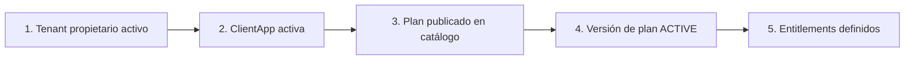
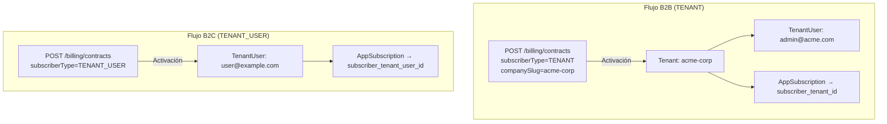
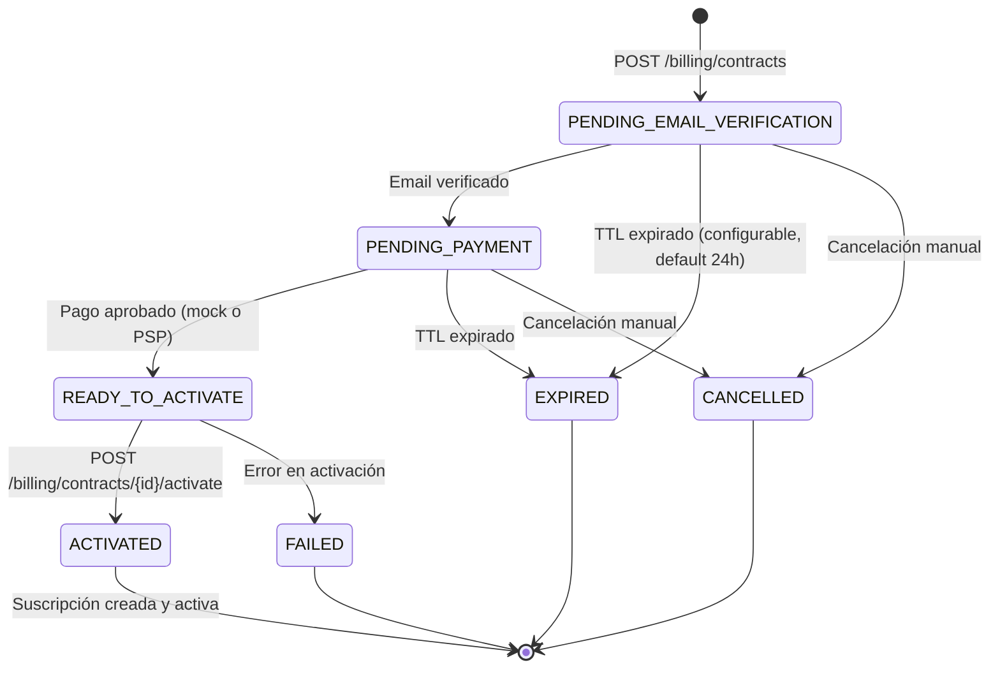
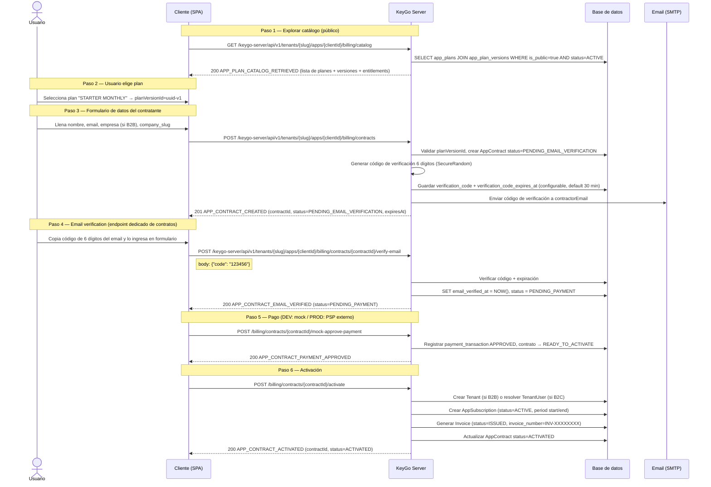
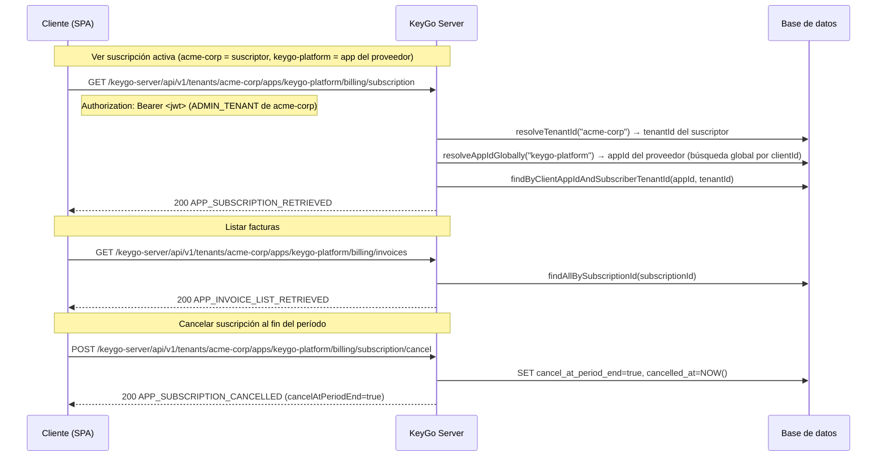
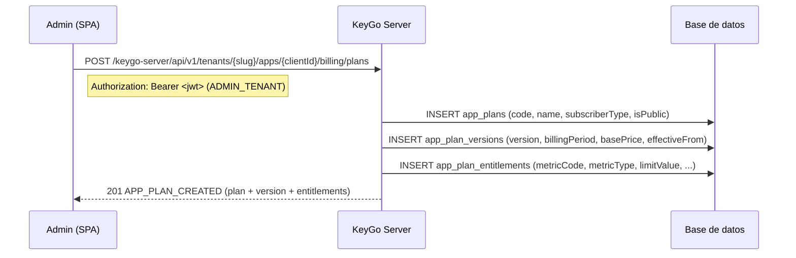

# Flujo de Contratación y Billing — KeyGo Server

> Guía de referencia del flujo de billing implementado: catálogo de planes, contratación self-service, pago, activación, suscripción y facturación.
>
> Fecha de actualización: **2026-03-29** | Estado: **Fase Billing B-1→B-8 + correcciones post-revisión**

---

## Tabla de contenidos

1. [Resumen ejecutivo](#resumen-ejecutivo)
2. [Prerrequisitos del sistema](#prerrequisitos-del-sistema)
3. [Modelo de suscriptor: TENANT (B2B) vs TENANT_USER (B2C)](#modelo-de-suscriptor-tenant-b2b-vs-tenant_user-b2c)
4. [Estados del contrato](#estados-del-contrato)
5. [Seguridad de endpoints](#seguridad-de-endpoints)
6. [Flujo principal: contratación self-service](#flujo-principal-contratación-self-service)
7. [Gestión post-activación](#gestión-post-activación)
8. [Gestión de catálogo (admin)](#gestión-de-catálogo-admin)
9. [Referencia de endpoints](#referencia-de-endpoints)
10. [Cuerpos de request y respuesta](#cuerpos-de-request-y-respuesta)
11. [Manejo de errores](#manejo-de-errores)
12. [Referencias cruzadas](#referencias-cruzadas)

---

## Resumen ejecutivo

KeyGo Server implementa un flujo de billing **multi-tenant, multi-app y polimórfico** que permite a cualquier `ClientApp` ofrecer planes de suscripción a sus propios suscriptores.

| Característica | Estado actual |
|---|---|
| Catálogo de planes públicos (lectura) | ✅ Implementado |
| Planes con versiones e entitlements | ✅ Implementado |
| Contratos de suscripción self-service | ✅ Implementado |
| Verificación de email del contratante (código 6 dígitos) | ✅ Implementado |
| Pago simulado (mock, solo DEV) | ✅ Implementado |
| Activación: crea tenant + usuario + suscripción + factura | ✅ Implementado |
| Gestión de suscripción (ver, cancelar) | ✅ Implementado |
| Listado de facturas | ✅ Implementado |
| Creación de planes (admin) | ✅ Implementado |
| Pasarela de pago real (MercadoPago, Stripe) | ⏳ Pendiente |
| Renovación automática | ⏳ Pendiente |
| Portal de facturación con PDF | ⏳ Pendiente |

El `context-path` activo es `/keygo-server`; todas las URLs deben incluirlo.

---

## Prerrequisitos del sistema

Antes de iniciar un flujo de contratación, deben existir:



| Recurso | Cómo se crea | Campo clave |
|---|---|---|
| Tenant propietario | `POST /api/v1/tenants` (Bearer ADMIN) | `slug` |
| ClientApp | `POST /api/v1/tenants/{slug}/apps` (Bearer ADMIN) | `clientId` |
| Plan de billing | `POST /api/v1/tenants/{slug}/apps/{clientId}/billing/plans` (Bearer ADMIN_TENANT) | `code`, `subscriberType` |

---

## Modelo de suscriptor: TENANT (B2B) vs TENANT_USER (B2C)

El campo `subscriberType` controla quién es el suscriptor del plan y qué entidades se crean en la activación.

| Dimensión | `TENANT` (B2B) | `TENANT_USER` (B2C) |
|---|---|---|
| Caso de uso | Empresa/organización contrató un plan institucional | Individuo/persona contrató un plan personal |
| Suscriptor creado | Nuevo `Tenant` (con el `companySlug`) | Nuevo `TenantUser` |
| Campos requeridos en contrato | `companyName`, `companySlug` (debe ser único) | Solo datos personales del contratante |
| `AppSubscription` vinculada a | `subscriber_tenant_id` (B2B) | `subscriber_tenant_user_id` (B2C) |
| Admin creado | `TenantUser` con email del contratante | El propio contratante |



> **Invariante:** `subscriberType` en el contrato debe coincidir con `subscriberType` del plan seleccionado. Se valida a nivel de aplicación.

---

## Estados del contrato



| Estado | Descripción | Transición siguiente |
|---|---|---|
| `PENDING_EMAIL_VERIFICATION` | Estado inicial; espera confirmación de email | → `PENDING_PAYMENT` |
| `PENDING_PAYMENT` | Email verificado; espera confirmación de pago | → `READY_TO_ACTIVATE` |
| `READY_TO_ACTIVATE` | Pago verificado; listo para activar | → `ACTIVATED` |
| `ACTIVATED` | Contrato activo; tenant/user + suscripción + factura creados | terminal |
| `EXPIRED` | TTL superado; debe crearse un nuevo contrato | terminal |
| `CANCELLED` | Cancelado manualmente | terminal |
| `FAILED` | Error en activación | terminal |

---

## Seguridad de endpoints

Con el filtro `BootstrapAdminKeyFilter` actual:

| Endpoint | Auth requerida |
|---|---|
| `GET /billing/catalog` | **Público** — sin Bearer ni X-KEYGO-ADMIN |
| `GET /billing/catalog/{planCode}` | **Público** |
| `POST /billing/contracts` | **Público** — el flujo de contratación es autoservicio |
| `GET /billing/contracts/{contractId}` | **Público** — se consulta por UUID |
| `POST /billing/contracts/{contractId}/verify-email` | **Público** — valida el código de 6 dígitos enviado al email del contratante |
| `POST /billing/contracts/{contractId}/mock-approve-payment` | **Público (solo DEV)** — requiere `keygo.billing.mock-payment-enabled=true` |
| `POST /billing/contracts/{contractId}/activate` | **Público** — el contrato debe estar en `READY_TO_ACTIVATE` |
| `GET /billing/subscription` | **Bearer ADMIN o ADMIN_TENANT** |
| `POST /billing/subscription/cancel` | **Bearer ADMIN o ADMIN_TENANT** |
| `GET /billing/invoices` | **Bearer ADMIN o ADMIN_TENANT** |
| `POST /billing/plans` | **Bearer ADMIN_TENANT** |

> Los sufijos `/billing/catalog` y `/billing/contracts` están declarados como públicos en `KeyGoBootstrapProperties`.

---

## Semántica de `{slug}` y `{clientId}` en los endpoints de billing

> ⚠️ Los endpoints de billing tienen DOS roles distintos para los path variables, dependiendo del contexto:

| Grupo de endpoints | `{slug}` refiere a | `{clientId}` refiere a | Resolución |
|---|---|---|---|
| Catálogo y planes (`/billing/catalog`, `/billing/plans`) | **Tenant PROVEEDOR** (quien ofrece los planes) | App del **PROVEEDOR** | `findByClientIdAndTenantId` — requiere que ambos existan |
| Contratos (`/billing/contracts`) | **Tenant PROVEEDOR** | App del **PROVEEDOR** | `findByClientIdAndTenantId` — el suscriptor aún no existe |
| Suscripción e invoices (`/billing/subscription`, `/billing/invoices`) | **Tenant SUSCRIPTOR** (empresa que contrató el plan) | App del **PROVEEDOR** (su `client_id` es globalmente único) | `findByClientId` global — el proveedor no necesita coincidir con el slug |

**Ejemplo concreto:**
- Proveedor: tenant `keygo`, app `keygo-platform`
- Suscriptor: tenant `acme-corp` (creado al activar el contrato)
- Catálogo: `GET /api/v1/tenants/keygo/apps/keygo-platform/billing/catalog`
- Iniciar contrato: `POST /api/v1/tenants/keygo/apps/keygo-platform/billing/contracts`
- Ver suscripción (desde acme-corp): `GET /api/v1/tenants/acme-corp/apps/keygo-platform/billing/subscription`

---

## Flujo principal: contratación self-service

### Vista rápida: quién hace qué en cada paso

| Paso | Usuario final | Cliente (SPA/app) | KeyGo Server |
|---|---|---|---|
| 1. Explorar catálogo | Ve los planes disponibles | Llama `GET /billing/catalog` | Devuelve planes públicos + versiones + entitlements |
| 2. Seleccionar plan | Elige un plan y período | Obtiene el `planVersionId` del plan elegido | — |
| 3. Crear contrato | Llena formulario (nombre, email, empresa si B2B) | Llama `POST /billing/contracts` | Crea contrato en `PENDING_EMAIL_VERIFICATION`, envía email |
| 4. Verificar email | Recibe y copia el código del email | Envía código a endpoint de verificación | Valida código, avanza contrato a `PENDING_PAYMENT` |
| 5. Pagar | Interactúa con pasarela de pago | Redirige a PSP o llama `mock-approve-payment` en DEV | Registra pago aprobado, avanza a `READY_TO_ACTIVATE` |
| 6. Activar | Normalmente automático | Llama `POST /billing/contracts/{id}/activate` | Crea tenant/user + suscripción + factura, marca `ACTIVATED` |



---

## Gestión post-activación

Una vez activado el contrato, el tenant **suscriptor** puede gestionar su suscripción vía Bearer JWT con rol `ADMIN_TENANT`.

> **Importante:** En los endpoints de gestión de suscripción, `{slug}` es el tenant del **SUSCRIPTOR** (el que contrató), y `{clientId}` es el `client_id` global de la app del **PROVEEDOR**. El `client_id` es globalmente único en OAuth2, por lo que se resuelve sin filtrar por tenant.



---

## Gestión de catálogo (admin)

El administrador de tenant (`ADMIN_TENANT`) puede crear planes con versión inicial y entitlements en una sola llamada.



---

## Referencia de endpoints

| Método | Endpoint (sin context-path) | Auth | `ResponseCode` OK | Descripción |
|---|---|---|---|---|
| GET | `/api/v1/tenants/{slug}/apps/{clientId}/billing/catalog` | Público | `APP_PLAN_CATALOG_RETRIEVED` | Catálogo público de planes (`{slug}/{clientId}` = PROVEEDOR) |
| GET | `/api/v1/tenants/{slug}/apps/{clientId}/billing/catalog/{planCode}` | Público | `APP_PLAN_RETRIEVED` | Detalle de un plan público |
| POST | `/api/v1/tenants/{slug}/apps/{clientId}/billing/plans` | Bearer ADMIN_TENANT | `APP_PLAN_CREATED` | Crear plan + versión + entitlements |
| POST | `/api/v1/tenants/{slug}/apps/{clientId}/billing/contracts` | Público | `APP_CONTRACT_CREATED` | Iniciar contrato (`{slug}/{clientId}` = PROVEEDOR); envía email con código |
| GET | `/api/v1/tenants/{slug}/apps/{clientId}/billing/contracts/{contractId}` | Público | `APP_CONTRACT_RETRIEVED` | Estado del contrato |
| POST | `/api/v1/tenants/{slug}/apps/{clientId}/billing/contracts/{contractId}/verify-email` | Público | `APP_CONTRACT_EMAIL_VERIFIED` | Verificar código de email → avanza a `PENDING_PAYMENT` |
| POST | `/api/v1/tenants/{slug}/apps/{clientId}/billing/contracts/{contractId}/mock-approve-payment` | Público (DEV) | `APP_CONTRACT_PAYMENT_APPROVED` | Simular pago aprobado |
| POST | `/api/v1/tenants/{slug}/apps/{clientId}/billing/contracts/{contractId}/activate` | Público | `APP_CONTRACT_ACTIVATED` | Activar contrato → crea entidades + suscripción + factura |
| GET | `/api/v1/tenants/{subscriberSlug}/apps/{providerClientId}/billing/subscription` | Bearer ADMIN/ADMIN_TENANT | `APP_SUBSCRIPTION_RETRIEVED` | Suscripción activa (`{subscriberSlug}` = SUSCRIPTOR, `{providerClientId}` = PROVEEDOR global) |
| POST | `/api/v1/tenants/{subscriberSlug}/apps/{providerClientId}/billing/subscription/cancel` | Bearer ADMIN/ADMIN_TENANT | `APP_SUBSCRIPTION_CANCELLED` | Marcar cancelación al fin del período |
| GET | `/api/v1/tenants/{subscriberSlug}/apps/{providerClientId}/billing/invoices` | Bearer ADMIN/ADMIN_TENANT | `APP_INVOICE_LIST_RETRIEVED` | Lista de facturas |

---

## Cuerpos de request y respuesta

### POST `/billing/contracts/{contractId}/verify-email` — request

```json
{
  "code": "123456"
}
```

### POST `/billing/contracts/{contractId}/verify-email` — respuesta exitosa

```json
{
  "date": "2026-03-29T10:05:00Z",
  "success": {
    "code": "APP_CONTRACT_EMAIL_VERIFIED",
    "message": "Contract email verified successfully"
  },
  "data": {
    "id": "contract-uuid",
    "status": "PENDING_PAYMENT",
    "emailVerified": true,
    "paymentVerified": false,
    "expiresAt": "2026-03-30T10:00:00Z"
  }
}
```

> **Errores posibles:** `400 INVALID_INPUT` si el código es incorrecto o expiró.

---

### POST `/billing/contracts` — request

```json
{
  "planVersionId": "uuid-de-la-version-del-plan",
  "billingPeriod": "MONTHLY",
  "subscriberType": "TENANT",
  "contractorEmail": "admin@acme.com",
  "contractorFirstName": "Carlos",
  "contractorLastName": "Martínez",
  "companyName": "Acme Corp",
  "companySlug": "acme-corp",
  "companyTaxId": "RFC123456XYZ",
  "companyAddress": "Av. Reforma 300, CDMX"
}
```

> Para `subscriberType=TENANT_USER`, omitir todos los campos `company*`.

### POST `/billing/contracts` — respuesta exitosa

```json
{
  "date": "2026-03-29T10:00:00Z",
  "success": {
    "code": "APP_CONTRACT_CREATED",
    "message": "App contract created successfully"
  },
  "data": {
    "id": "contract-uuid",
    "clientAppId": "app-uuid",
    "selectedPlanVersionId": "version-uuid",
    "billingPeriod": "MONTHLY",
    "subscriberType": "TENANT",
    "status": "PENDING_EMAIL_VERIFICATION",
    "contractorEmail": "admin@acme.com",
    "contractorFirstName": "Carlos",
    "contractorLastName": "Martínez",
    "companyName": "Acme Corp",
    "companySlug": "acme-corp",
    "emailVerified": false,
    "paymentVerified": false,
    "expiresAt": "2026-03-30T10:00:00Z",
    "createdAt": "2026-03-29T10:00:00Z"
  }
}
```

### POST `/billing/plans` — request

```json
{
  "code": "STARTER",
  "name": "Plan Starter",
  "description": "Plan básico para equipos pequeños",
  "subscriberType": "TENANT",
  "isPublic": true,
  "version": "1.0",
  "billingPeriod": "MONTHLY",
  "basePrice": 299.00,
  "currency": "MXN",
  "trialDays": 14,
  "effectiveFrom": "2026-04-01",
  "entitlements": [
    {
      "metricCode": "MAX_USERS",
      "metricType": "QUOTA",
      "limitValue": 10,
      "periodType": "NONE",
      "enforcementMode": "HARD",
      "isEnabled": true
    },
    {
      "metricCode": "ALLOW_SSO",
      "metricType": "BOOLEAN",
      "limitValue": null,
      "periodType": "NONE",
      "enforcementMode": "HARD",
      "isEnabled": false
    }
  ]
}
```

### GET `/billing/catalog` — respuesta

```json
{
  "date": "2026-03-29T10:00:00Z",
  "success": {
    "code": "APP_PLAN_CATALOG_RETRIEVED",
    "message": "App plan catalog retrieved successfully"
  },
  "data": [
    {
      "id": "plan-uuid",
      "clientAppId": "app-uuid",
      "code": "STARTER",
      "name": "Plan Starter",
      "description": "Plan básico para equipos pequeños",
      "subscriberType": "TENANT",
      "status": "ACTIVE",
      "isPublic": true,
      "versions": [
        {
          "id": "version-uuid",
          "version": "1.0",
          "currency": "MXN",
          "billingPeriod": "MONTHLY",
          "basePrice": 299.00,
          "setupFee": 0.00,
          "trialDays": 14,
          "effectiveFrom": "2026-04-01",
          "effectiveTo": null,
          "status": "ACTIVE"
        }
      ],
      "entitlements": [
        {
          "id": "entitlement-uuid",
          "metricCode": "MAX_USERS",
          "metricType": "QUOTA",
          "limitValue": 10,
          "periodType": "NONE",
          "enforcementMode": "HARD",
          "isEnabled": true
        }
      ]
    }
  ]
}
```

### GET `/billing/subscription` — respuesta

```json
{
  "date": "2026-03-29T10:00:00Z",
  "success": {
    "code": "APP_SUBSCRIPTION_RETRIEVED",
    "message": "App subscription retrieved successfully"
  },
  "data": {
    "id": "subscription-uuid",
    "clientAppId": "app-uuid",
    "appPlanVersionId": "version-uuid",
    "subscriberType": "TENANT",
    "subscriberTenantId": "tenant-uuid",
    "subscriberTenantUserId": null,
    "status": "ACTIVE",
    "currentPeriodStart": "2026-03-29T10:00:00Z",
    "currentPeriodEnd": "2026-04-29T10:00:00Z",
    "cancelAtPeriodEnd": false,
    "nextBillingAt": "2026-04-29T10:00:00Z",
    "autoRenew": true,
    "createdAt": "2026-03-29T10:00:00Z"
  }
}
```

### GET `/billing/invoices` — respuesta

```json
{
  "date": "2026-03-29T10:00:00Z",
  "success": {
    "code": "APP_INVOICE_LIST_RETRIEVED",
    "message": "App invoice list retrieved successfully"
  },
  "data": [
    {
      "id": "invoice-uuid",
      "subscriptionId": "subscription-uuid",
      "invoiceNumber": "INV-A1B2C3D4",
      "status": "ISSUED",
      "issueDate": "2026-03-29",
      "dueDate": "2026-04-28",
      "periodStart": "2026-03-29",
      "periodEnd": "2026-04-29",
      "currency": "MXN",
      "subtotal": 299.00,
      "taxAmount": 0.00,
      "total": 299.00,
      "billingNameSnapshot": "Carlos Martínez",
      "planVersionSnapshot": "1.0",
      "pdfUrl": null,
      "createdAt": "2026-03-29T10:00:00Z"
    }
  ]
}
```

---

## Manejo de errores

### ResponseCodes de billing

| `failure.code` | HTTP | Causa típica |
|---|---|---|
| `APP_PLAN_NOT_FOUND` | 404 | Plan no existe o no es público |
| `APP_PLAN_VERSION_NOT_FOUND` | 404 | `planVersionId` no existe |
| `APP_CONTRACT_NOT_FOUND` | 404 | `contractId` no existe |
| `APP_SUBSCRIPTION_NOT_FOUND` | 404 | No hay suscripción activa para ese app+tenant |
| `APP_INVOICE_NOT_FOUND` | 404 | Factura no encontrada |
| `APP_CONTRACT_ALREADY_ACTIVATED` | 400 | Contrato ya fue activado (idempotente: devuelve 200) |
| `APP_CONTRACT_NOT_READY` | 400 | Contrato no está en `READY_TO_ACTIVATE` |
| `INVALID_INPUT` | 400 | `companySlug` duplicado, `planVersionId` inválido, etc. |
| `RESOURCE_NOT_FOUND` | 404 | Tenant o ClientApp no existe (`tenantSlug` / `clientId` inválido) |
| `AUTHENTICATION_REQUIRED` | 401 | Bearer token faltante o inválido (endpoints protegidos) |
| `INSUFFICIENT_PERMISSIONS` | 403 | Rol insuficiente (se requiere `ADMIN_TENANT`) |
| `OPERATION_FAILED` | 500 | Error en activación u operación interna |

### Tabla de decisiones UI para errores de contratación

| Etapa | `failure.code` frecuentes | Acción UX recomendada |
|---|---|---|
| `GET /billing/catalog` | `RESOURCE_NOT_FOUND` | Mostrar "Catálogo no disponible" + reintento |
| `POST /billing/contracts` | `INVALID_INPUT` (slug duplicado) | Mostrar inline "Este identificador ya está en uso" |
| `POST /billing/contracts` | `RESOURCE_NOT_FOUND` (planVersion) | Refrescar catálogo y pedir al usuario que reseleccione |
| `POST .../mock-approve-payment` | `RESOURCE_NOT_FOUND` | Mock desactivado en producción — no exponer este endpoint |
| `POST .../activate` | `APP_CONTRACT_NOT_READY` | Mostrar estado del contrato + instrucciones para completar pasos previos |
| `POST .../activate` | `OPERATION_FAILED` | Mostrar error de sistema + opción de reintentar o contactar soporte |
| `GET /billing/subscription` | `APP_SUBSCRIPTION_NOT_FOUND` | Mostrar "Sin suscripción activa" + CTA para contratar |

---

## Referencias cruzadas

| Documento | Ruta | Relevancia |
|---|---|---|
| Flujo de Autenticación | `docs/api/AUTH_FLOW.md` | Flujo OAuth2/PKCE — prerequisito para endpoints con Bearer |
| Guía Frontend | `docs/keygo-ui/FRONTEND_DEVELOPER_GUIDE.md` | Sección §14.3 — inventario de endpoints de billing |
| Modelo de datos | `docs/data/DATA_MODEL.md` | Diccionario de tablas `app_plans`, `app_contracts`, etc. |
| Relaciones E/R | `docs/data/ENTITY_RELATIONSHIPS.md` | Contexto 9 — diagrama de billing |
| Migraciones | `docs/data/MIGRATIONS.md` | V16–V19 — schema de billing |
| Colección Postman | `docs/postman/KeyGo-Server.postman_collection.json` | Requests con scripts de test |
| Swagger UI | `http://localhost:8080/keygo-server/swagger-ui/index.html` | Exploración interactiva |


