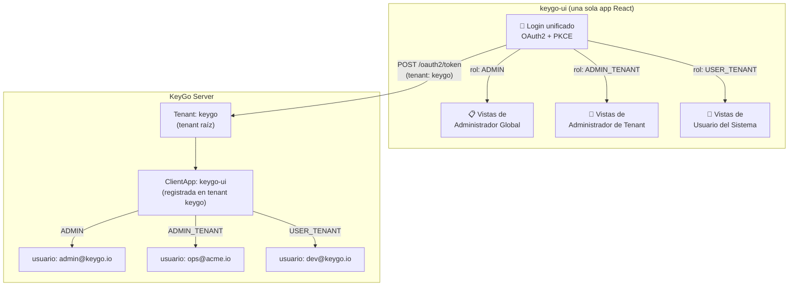
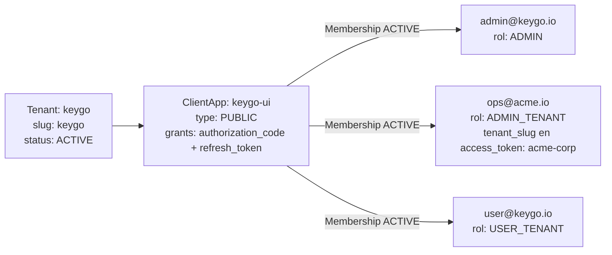
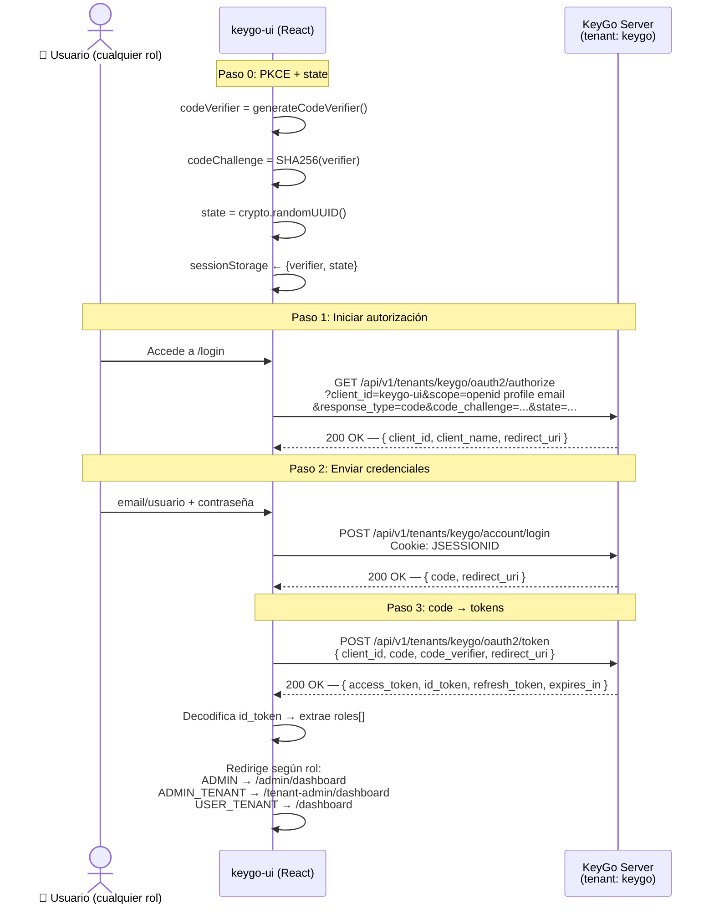
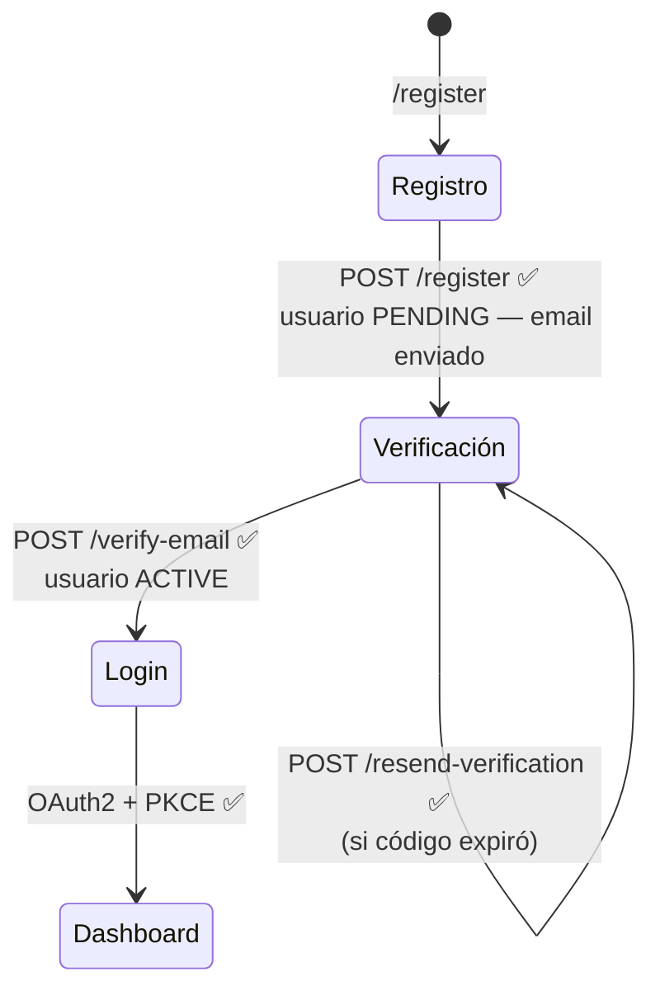

# Manual del Desarrollador Frontend — `keygo-ui`

> * **Audiencia:** Desarrolladores frontend que implementan la interfaz de usuario de KeyGo usando React. 
> * **Versión del backend:** KeyGo Server 1.0-SNAPSHOT (Fases 0-9b completadas, Fase 10 pendiente).
> * **Fecha:** 2026-03-26
> * **Estado:** Documento vivo — se actualiza conforme avanza el backend.

---

## Tabla de contenidos

1. [Visión general y modelo unificado](#1-visión-general-y-modelo-unificado)
2. [Stack tecnológico recomendado](#2-stack-tecnológico-recomendado)
3. [Estructura del proyecto](#3-estructura-del-proyecto)
4. [Prerequisito: el tenant `keygo` y la ClientApp `keygo-ui`](#4-prerequisito-el-tenant-keygo-y-la-clientapp-keygo-ui)
5. [Convenciones fundamentales del backend](#5-convenciones-fundamentales-del-backend)
6. [Flujo de autenticación OAuth2/PKCE — login único para todos los roles](#6-flujo-de-autenticación-oauth2pkce--login-único-para-todos-los-roles)
7. [Gestión de roles y routing condicional](#7-gestión-de-roles-y-routing-condicional)
8. [Vistas del rol `ADMIN` — Administrador Global de KeyGo](#8-vistas-del-rol-admin--administrador-global-de-keygo)
9. [Vistas del rol `ADMIN_TENANT` — Administrador de Tenant](#9-vistas-del-rol-admin_tenant--administrador-de-tenant)
10. [Vistas del rol `USER_TENANT` — Usuario del sistema](#10-vistas-del-rol-user_tenant--usuario-del-sistema)
11. [Perfil de usuario — compartido por todos los roles](#11-perfil-de-usuario--compartido-por-todos-los-roles)
12. [Gestión segura de tokens](#12-gestión-segura-de-tokens)
13. [Interceptores HTTP y manejo de errores](#13-interceptores-http-y-manejo-de-errores)
14. [Inventario de endpoints — disponibles vs. pendientes](#14-inventario-de-endpoints--disponibles-vs-pendientes)
15. [Guía de mocking para features pendientes](#15-guía-de-mocking-para-features-pendientes)
16. [Checklist de seguridad](#16-checklist-de-seguridad)
17. [Comandos de verificación del backend](#17-comandos-de-verificación-del-backend)
18. [Referencias](#18-referencias)

---

## 1. Visión general y modelo unificado

### 1.1. Una sola app, un solo login

`keygo-ui` debe entenderse en **dos modos complementarios**:

1. **Modo plataforma:** `keygo-ui` como aplicación React registrada como `ClientApp` en el tenant raíz `keygo`.
2. **Modo hosted login:** la misma UI de login reutilizada por otra SPA/app de otro tenant, pero usando el `tenantSlug` + `client_id` + `redirect_uri` de la app origen.

En ambos casos se reutiliza el **mismo flujo OAuth2/PKCE** y la misma experiencia de login.
Lo que cambia es **quién es el cliente OAuth final** que recibirá y almacenará los tokens.



> Este diagrama representa el **modo plataforma**. Si `keygo-ui` opera como login central para otra app,
> la UI puede seguir siendo la misma, pero el `tenantSlug`, el `client_id`, la `redirect_uri` y el
> almacenamiento final de tokens pertenecen a la **app origen**, no al tenant `keygo`.

### 1.2. Los tres roles

| Rol | ¿Quién es? | ¿Qué gestiona? |
|---|---|---|
| `ADMIN` | Operador del SaaS KeyGo | Todos los tenants, configuración global de la plataforma |
| `ADMIN_TENANT` | Administrador de una organización | Su tenant: apps, usuarios, memberships, roles |
| `USER_TENANT` | Cualquier usuario registrado en keygo-ui | Su perfil, contraseña, sesiones activas |

### 1.3. Modelo de autenticación — estado actual vs. objetivo

| Aspecto | Estado actual (backend) | Estado objetivo |
|---|---|---|
| Login | OAuth2/PKCE ✅ | OAuth2/PKCE ✅ |
| Roles en JWT | Claim `roles` implementado en tokens de usuario ✅ | Mantener y endurecer validaciones por permiso |
| Scope de tenant en seguridad admin | Claim `tenant_slug` en access token + fallback `iss` ✅ | Mantener contrato estable para UI + APIs admin |
| Protección endpoints admin | JWT Bearer + `@PreAuthorize` (`ADMIN`/`ADMIN_TENANT` con tenant match) ✅ | Evolución a RBAC más granular (F-040) |

> ✅ **Estado actual:** El backend valida Bearer JWT en endpoints admin y aplica autorización por
> `@PreAuthorize` con validación de tenant (`tenant_slug` o `iss` vs `tenantSlug` en path).

---

## 2. Stack tecnológico recomendado

| Capa | Herramienta | Versión | Justificación |
|---|---|---|---|
| Bundler | **Vite** | 6.x | Build ultra rápido, HMR nativo, ESModules |
| Framework | **React** | 19.x | Ecosistema maduro, concurrent features |
| Lenguaje | **TypeScript** | 5.x | Tipado estricto para DTOs y ResponseCodes |
| Router | **React Router** | 7.x | Layouts anidados por rol, rutas tipadas, loaders |
| Estado global | **Zustand** | 5.x | Liviano, sin boilerplate, tokens en memoria |
| Fetching / caché | **TanStack Query** | 5.x | Invalidación automática, loading/error states |
| Formularios | **React Hook Form + Zod** | latest | Validación declarativa e inferida desde tipos |
| HTTP | **Axios** | 1.x | Interceptores para `Authorization: Bearer` |
| Estilos | **Tailwind CSS v4 + shadcn/ui** | latest | Accesibilidad, headless, personalizable |
| JWT (browser) | **jose** | 5.x | Verificación RS256 con JWKS + decodificación de claims |
| PKCE | **Web Crypto API** | nativo | Sin dependencias externas para SHA-256 + Base64URL |
| Testing | **Vitest + Testing Library + MSW** | latest | Mocks de API sin levantar servidor |

---

## 3. Estructura del proyecto

Una sola aplicación con layouts y rutas diferenciadas por rol:

```
keygo-ui/
├── src/
│   ├── auth/
│   │   ├── pkce.ts            # generateCodeVerifier, generateCodeChallenge, generateState
│   │   ├── tokenStore.ts      # Zustand store: accessToken, idToken, refreshToken, roles
│   │   ├── roleGuard.tsx      # <RoleGuard> y <AuthGuard> para proteger rutas
│   │   ├── refresh.ts         # Silent refresh automático (80% del TTL)
│   │   ├── jwksVerify.ts      # Verificación RS256 con jose + JWKS + decodeIdToken
│   │   └── logout.ts          # POST /oauth2/revoke + limpiar store
│   │
│   ├── api/
│   │   ├── client.ts          # Instancia Axios base + interceptores + constantes
│   │   ├── tenants.ts         # Endpoints de Control Plane (ADMIN)
│   │   ├── clientApps.ts      # Endpoints de ClientApps (ADMIN_TENANT)
│   │   ├── users.ts           # Endpoints de Usuarios (ADMIN_TENANT)
│   │   ├── memberships.ts     # Endpoints de Memberships y Roles (ADMIN_TENANT)
│   │   └── userinfo.ts        # Endpoint UserInfo (todos)
│   │
│   ├── layouts/
│   │   ├── RootLayout.tsx         # Shell principal (topbar, sidebar adaptativo)
│   │   ├── AdminLayout.tsx        # Layout extendido para ADMIN
│   │   ├── TenantAdminLayout.tsx  # Layout para ADMIN_TENANT (provee ctx del tenant)
│   │   └── UserLayout.tsx         # Layout mínimo para USER_TENANT
│   │
│   ├── pages/
│   │   ├── login/
│   │   │   ├── LoginPage.tsx        # Formulario de credenciales (Pasos 0, 1 y 2)
│   │   │   └── CallbackPage.tsx     # Intercambio code → token (Paso 3) + routing por rol
│   │   ├── register/
│   │   │   ├── RegisterPage.tsx     # Auto-registro (público)
│   │   │   ├── VerifyEmailPage.tsx  # Verificar código recibido por email
│   │   │   └── ResendPage.tsx       # Reenviar código si expiró
│   │   ├── admin/                   # Solo accesible con rol ADMIN
│   │   │   ├── DashboardPage.tsx
│   │   │   ├── TenantsPage.tsx      # ⏳ Listar tenants (mock)
│   │   │   ├── CreateTenantPage.tsx
│   │   │   └── TenantDetailPage.tsx
│   │   ├── tenant-admin/            # Accesible con ADMIN o ADMIN_TENANT
│   │   │   ├── DashboardPage.tsx
│   │   │   ├── AppsPage.tsx
│   │   │   ├── UsersPage.tsx
│   │   │   └── MembershipsPage.tsx
│   │   ├── user/
│   │   │   └── DashboardPage.tsx    # Dashboard para USER_TENANT
│   │   └── shared/                  # Todos los roles autenticados
│   │       ├── ProfilePage.tsx
│   │       ├── ChangePasswordPage.tsx  # ⏳ pendiente
│   │       └── SessionsPage.tsx        # ⏳ pendiente
│   │
│   ├── components/
│   │   ├── BaseResponseHandler.tsx   # Manejo centralizado de BaseResponse<T>
│   │   ├── RoleAwareNav.tsx          # Sidebar/menú adaptativo por rol
│   │   ├── PendingFeatureBadge.tsx   # Badge "Próximamente"
│   │   └── SecretRevealModal.tsx     # clientSecret — mostrar solo una vez
│   │
│   ├── hooks/
│   │   ├── useCurrentUser.ts    # UserInfo desde tokenStore + GET /userinfo
│   │   ├── useHasRole.ts        # Comprueba rol del JWT
│   │   └── useManagedTenant.ts  # Slug del tenant que gestiona el ADMIN_TENANT
│   │
│   ├── types/
│   │   ├── base.ts       # BaseResponse<T>, MessageResponse
│   │   ├── tenant.ts     # TenantData, CreateTenantRequest
│   │   ├── clientapp.ts  # ClientAppData, CreateClientAppRequest
│   │   ├── user.ts       # TenantUserData, CreateUserRequest
│   │   ├── auth.ts       # TokenData, UserInfoData, KeyGoJwtClaims
│   │   └── roles.ts      # AppRole enum (ADMIN | ADMIN_TENANT | USER_TENANT)
│   │
│   ├── mocks/
│   │   ├── handlers.ts   # MSW — handlers para endpoints pendientes
│   │   └── browser.ts    # setupWorker de MSW
│   │
│   ├── router.tsx        # Definición de rutas + guardias por rol
│   ├── App.tsx
│   └── main.tsx
│
├── .env.local            # Variables de entorno locales (NO commitear)
├── vite.config.ts
└── package.json
```

---

## 4. Prerequisito: el tenant `keygo` y la ClientApp `keygo-ui`

Antes de que cualquier usuario pueda acceder a `keygo-ui`, el backend debe tener configurado el tenant
raíz y la app. Esto se hace **una sola vez** al inicializar el entorno.

### 4.1. Estructura requerida en el backend



### 4.2. Script de bootstrap

```bash
BASE="http://localhost:8080/keygo-server/api/v1"
TOKEN="<admin_bearer_jwt>"

# 1. Crear tenant raíz "keygo" (slug se deriva del nombre)
curl -s -X POST "$BASE/tenants" \
  -H "Authorization: Bearer $TOKEN" -H "Content-Type: application/json" \
  -d '{"name":"KeyGo Platform","ownerEmail":"admin@keygo.io"}' | jq .

# 2. Crear la ClientApp keygo-ui (PUBLIC — SPA, sin client_secret)
RESP=$(curl -s -X POST "$BASE/tenants/keygo/apps" \
  -H "Authorization: Bearer $TOKEN" -H "Content-Type: application/json" \
  -d '{
    "name": "KeyGo UI",
    "description": "SPA oficial de KeyGo",
    "type": "PUBLIC",
    "grants": ["AUTHORIZATION_CODE","REFRESH_TOKEN"],
    "scopes": ["openid","profile","email"],
    "redirectUris": ["http://localhost:5173/callback"]
  }')
CLIENT_ID=$(echo "$RESP" | jq -r '.data.clientId')
echo "CLIENT_ID: $CLIENT_ID"   # Usa este valor en VITE_CLIENT_ID

# 2.1 Resolver UUID interno de la app (requerido por memberships/roles)
APP_ID=$(curl -s -X GET "$BASE/tenants/keygo/apps" \
  -H "Authorization: Bearer $TOKEN" | jq -r --arg cid "$CLIENT_ID" '.data[] | select(.clientId==$cid) | .id')
echo "APP_ID: $APP_ID"

# 3. Crear usuario administrador global
USER_RESP=$(curl -s -X POST "$BASE/tenants/keygo/users" \
  -H "Authorization: Bearer $TOKEN" -H "Content-Type: application/json" \
  -d '{"email":"admin@keygo.io","username":"admin","password":"Admin1234!","firstName":"KeyGo","lastName":"Admin"}')
USER_ID=$(echo "$USER_RESP" | jq -r '.data.id')

# 4. Crear rol ADMIN en keygo-ui (usa APP_ID UUID)
ROLE_RESP=$(curl -s -X POST "$BASE/tenants/keygo/apps/$APP_ID/roles" \
  -H "Authorization: Bearer $TOKEN" -H "Content-Type: application/json" \
  -d '{"code":"ADMIN","displayName":"Administrador Global","description":"Rol de plataforma"}')
ROLE_ID=$(echo "$ROLE_RESP" | jq -r '.data.id')

# 5. Crear membership del admin en keygo-ui (ruta actual: /memberships)
curl -s -X POST "$BASE/tenants/keygo/memberships" \
  -H "Authorization: Bearer $TOKEN" -H "Content-Type: application/json" \
  -d "{\"userId\":\"$USER_ID\",\"clientAppId\":\"$APP_ID\",\"roleCodes\":[\"ADMIN\"]}" | jq .
```

### 4.3. Variables de entorno del frontend

```bash
# .env.local — NO commitear este archivo
VITE_KEYGO_BASE=http://localhost:8080/keygo-server
VITE_TENANT_SLUG=keygo
VITE_CLIENT_ID=keygo-ui                         # clientId devuelto en el paso 2 del bootstrap
VITE_REDIRECT_URI=http://localhost:5173/callback

# Backend admin auth es Bearer-only

# MSW — mocks para endpoints pendientes (solo desarrollo)
VITE_MOCK_ENABLED=true
VITE_MOCK_ROLE=ADMIN          # ADMIN | ADMIN_TENANT | USER_TENANT
VITE_MOCK_TENANT_SLUG=acme-corp
```

---

## 5. Convenciones fundamentales del backend

### 5.1. Envelope `BaseResponse<T>`

```typescript
// src/types/base.ts
export interface MessageResponse {
  code: string;
  message: string;
}

export interface BaseResponse<T = void> {
  date: string;
  success?: MessageResponse;
  failure?: MessageResponse;
  data?: T;
  debug?: MessageResponse;
  throwable?: string;
}

// Clasificacion del origen del error (campo `data.origin` en respuestas de error)
export type ErrorOrigin =
  | 'CLIENT_REQUEST'    // Error causado por la solicitud del cliente
  | 'BUSINESS_RULE'     // Regla de negocio que impide la operacion
  | 'SERVER_PROCESSING'; // Error interno del servidor

// Sub-clasificacion de errores de cliente (solo presente cuando origin === 'CLIENT_REQUEST')
export type ClientRequestCause =
  | 'USER_INPUT'        // Datos ingresados por el usuario (credenciales, campos de formulario)
  | 'CLIENT_TECHNICAL'; // Problema de integracion tecnica (cookie faltante, parametro mal construido)

/**
 * Estructura del campo `data` en respuestas de error.
 * BaseResponse<ErrorData> — envelope de todos los errores de la API.
 *
 * Guia de uso:
 *  - origin === 'CLIENT_REQUEST' && clientRequestCause === 'USER_INPUT'
 *      → mostrar clientMessage junto al formulario/campo
 *  - origin === 'CLIENT_REQUEST' && clientRequestCause === 'CLIENT_TECHNICAL'
 *      → revisar integracion tecnica; NO mostrar como culpa del usuario
 *  - origin === 'BUSINESS_RULE'
 *      → mostrar clientMessage; ofrecer accion alternativa si aplica
 *  - origin === 'SERVER_PROCESSING'
 *      → mostrar mensaje generico de reintento; loguear en monitoreo
 */
export interface ErrorData {
  /** ResponseCode del error (mismo valor que failure.code) */
  code: string;
  /** Origen del error */
  origin: ErrorOrigin;
  /** Sub-causa de errores de cliente (ausente si origin != 'CLIENT_REQUEST') */
  clientRequestCause?: ClientRequestCause;
  /** Mensaje amigable en espanol listo para mostrar al usuario */
  clientMessage: string;
  /** Detalle tecnico del error — solo en perfiles dev/local */
  detail?: string;
  /** Nombre de la clase de excepcion — solo en perfiles dev/local */
  exception?: string;
}

/** Alias tipado para respuestas de error de la API */
export type ErrorResponse = BaseResponse<ErrorData>;
```

### 5.2. Roles — enum

```typescript
// src/types/roles.ts
export const AppRole = {
  ADMIN:        'ADMIN',
  ADMIN_TENANT: 'ADMIN_TENANT',
  USER_TENANT:  'USER_TENANT',
} as const;

export type AppRoleValue = typeof AppRole[keyof typeof AppRole];
```

### 5.3. Claims del JWT de KeyGo

```typescript
// src/types/auth.ts
export interface KeyGoJwtClaims {
  sub:                 string;    // UUID del TenantUser (o client_id en M2M)
  email?:              string;
  name?:               string;
  preferred_username?: string;
  iss:                 string;    // "http://localhost:8080/keygo-server/api/v1/tenants/{slug}"
  aud:                 string;    // client_id (ej: "keygo-ui")
  iat:                 number;
  exp:                 number;
  scope:               string;
  roles?:              string[];  // ✅ Implementado para tokens de usuario
  tenant_slug?:        string;    // ✅ Access token admin: scope de tenant para autorización
}
```

### 5.4. URLs base

```typescript
// src/api/client.ts — constantes
export const KEYGO_BASE = import.meta.env.VITE_KEYGO_BASE;
export const API_V1     = `${KEYGO_BASE}/api/v1`;
export const TENANT     = import.meta.env.VITE_TENANT_SLUG ?? 'keygo';
export const CLIENT_ID  = import.meta.env.VITE_CLIENT_ID  ?? 'keygo-ui';

export const tenantUrl = (slug: string) => `${API_V1}/tenants/${slug}`;
export const appUrl    = (slug: string, clientId: string) =>
  `${tenantUrl(slug)}/apps/${clientId}`;
export const keygoUrl  = tenantUrl(TENANT);   // Atajo para tenant keygo
```

---

## 6. Flujo de autenticación OAuth2/PKCE — login único para todos los roles

La mecánica OAuth2 es la misma en ambos escenarios, pero hay que distinguir el contexto:

| Escenario | ¿Quién recibe los tokens finales? | Tenant del flujo |
|---|---|---|
| **Modo plataforma** (`keygo-ui` como app SaaS principal) | `keygo-ui` | `keygo` |
| **Modo hosted login** (`keygo-ui` como login central) | La app origen | El tenant de la app origen |

Regla de oro frontend: **reutilizar la pantalla de login no implica reutilizar la `ClientApp keygo-ui` ni el tenant `keygo`**.

### 6.0. Dos variantes del mismo flujo

- **Variante A — plataforma:** el ejemplo clasico de esta guia. `keygo-ui` inicia `/authorize`, hace login, canjea `code` y conserva los tokens.
- **Variante B — hosted login:** la app origen genera PKCE + `state`, navega al login central de `keygo-ui`, y luego ella misma canjea el `code` al volver a su callback.

En ambos casos, el backend sigue siendo el mismo: `/oauth2/authorize` -> `/account/login` -> `/oauth2/token`.

### 6.1. Diagrama del flujo base (modo plataforma, tenant `keygo`)



### 6.2. Utilidades PKCE

```typescript
// src/auth/pkce.ts
export function generateCodeVerifier(): string {
  const arr = new Uint8Array(64);
  crypto.getRandomValues(arr);
  return btoa(String.fromCharCode(...arr))
    .replace(/\+/g, '-').replace(/\//g, '_').replace(/=/g, '');
}

export async function generateCodeChallenge(verifier: string): Promise<string> {
  const data   = new TextEncoder().encode(verifier);
  const digest = await crypto.subtle.digest('SHA-256', data);
  return btoa(String.fromCharCode(...new Uint8Array(digest)))
    .replace(/\+/g, '-').replace(/\//g, '_').replace(/=/g, '');
}

export const generateState = () => crypto.randomUUID();
```

### 6.3. LoginPage — Pasos 0, 1 y 2

> El siguiente ejemplo corresponde al **modo plataforma** (tenant fijo `keygo`).
> Si `keygo-ui` opera como hosted login central, el contexto OAuth debe resolverse dinamicamente y no desde constantes fijas.

```typescript
// src/pages/login/LoginPage.tsx
import { useState, useEffect } from 'react';
import { generateCodeVerifier, generateCodeChallenge, generateState } from '@/auth/pkce';
import { API_V1, TENANT, CLIENT_ID } from '@/api/client';
import type { ErrorData } from '@/types/base';

function resolveClientError(body: { failure?: { message?: string }; data?: ErrorData }): string {
  // Preferir siempre el mensaje de negocio/UI provisto por ErrorData
  return body.data?.clientMessage ?? body.failure?.message ?? 'No pudimos completar la solicitud.';
}

function isUserInputError(body: { data?: ErrorData }): boolean {
  return body.data?.origin === 'CLIENT_REQUEST' && body.data?.clientRequestCause === 'USER_INPUT';
}

export function LoginPage() {
  const [clientName, setClientName] = useState('KeyGo');
  const [error, setError] = useState<string | null>(null);
  const [loading, setLoading] = useState(false);
  const redirectUri = import.meta.env.VITE_REDIRECT_URI;

  // Pasos 0 y 1 al montar
  useEffect(() => {
    (async () => {
      const verifier = generateCodeVerifier();
      const challenge = await generateCodeChallenge(verifier);
      const state = generateState();
      sessionStorage.setItem('pkce_code_verifier', verifier);
      sessionStorage.setItem('oauth_state', state);

      const params = new URLSearchParams({
        client_id: CLIENT_ID,
        redirect_uri: redirectUri,
        scope: 'openid profile email',
        response_type: 'code',
        code_challenge: challenge,
        code_challenge_method: 'S256',
        state,
      });

      const res = await fetch(`${API_V1}/tenants/${TENANT}/oauth2/authorize?${params}`, {
        credentials: 'include', // cookie JSESSIONID
      });
      const body = await res.json();

      if (body.success) {
        setClientName(body.data?.client_name ?? 'KeyGo');
        return;
      }

      setError(resolveClientError(body));
    })();
  }, []);

  // Paso 2: enviar credenciales
  const handleSubmit = async (e: React.FormEvent<HTMLFormElement>) => {
    e.preventDefault();
    setLoading(true);
    setError(null);

    const fd = new FormData(e.currentTarget);
    const res = await fetch(`${API_V1}/tenants/${TENANT}/account/login`, {
      method: 'POST',
      credentials: 'include',
      headers: { 'Content-Type': 'application/json' },
      body: JSON.stringify({
        emailOrUsername: fd.get('emailOrUsername'),
        password: fd.get('password'),
      }),
    });
    const body = await res.json();
    setLoading(false);

    if (!res.ok || body.failure) {
      const message = resolveClientError(body);

      // USER_INPUT: mostrar inline en formulario
      if (isUserInputError(body)) {
        setError(message);
        return;
      }

      // CLIENT_TECHNICAL / BUSINESS_RULE / SERVER_PROCESSING: mismo mensaje al usuario,
      // pero conviene loguear la metadata para diagnóstico del equipo.
      console.error('Login error metadata', body.data);
      setError(message);
      return;
    }

    const { code } = body.data;
    const oauthState = sessionStorage.getItem('oauth_state');
    window.location.href = `${redirectUri}?code=${code}&state=${oauthState}`;
  };

  return (
    <div className="min-h-screen flex items-center justify-center">
      <form onSubmit={handleSubmit} className="w-full max-w-sm space-y-4 p-8 rounded-xl shadow">
        <h1 className="text-2xl font-bold text-center">Iniciar sesión en {clientName}</h1>
        {error && <p className="text-destructive text-sm">{error}</p>}
        <input name="emailOrUsername" type="text" placeholder="Email o usuario" required className="input" />
        <input name="password" type="password" placeholder="Contraseña" required className="input" />
        <button type="submit" disabled={loading} className="btn btn-primary w-full">
          {loading ? 'Iniciando...' : 'Iniciar sesión'}
        </button>
        <p className="text-center text-sm">
          ¿No tienes cuenta? <a href="/register" className="underline text-primary">Regístrate</a>
        </p>
        <p className="text-center text-sm">
          <a href="#" className="text-muted-foreground cursor-not-allowed" title="Próximamente">
            ¿Olvidaste tu contraseña?
          </a>
        </p>
      </form>
    </div>
  );
}
```

Notas prácticas para `LoginPage`:
- Si `data.origin=CLIENT_REQUEST` y `data.clientRequestCause=USER_INPUT`, el problema es de datos capturados por el usuario (ej. credenciales inválidas).
- Si `data.origin=CLIENT_REQUEST` y `data.clientRequestCause=CLIENT_TECHNICAL`, el problema es de integración de la UI (ej. cookie de sesión, parámetros OAuth, endpoint equivocado).
- Si `data.origin=BUSINESS_RULE`, la solicitud fue técnicamente correcta pero bloqueada por reglas del dominio (ej. email no verificado).
- Si `data.origin=SERVER_PROCESSING`, mostrar mensaje genérico y recomendar reintento.

### 6.4. CallbackPage — Paso 3 + routing por rol

```typescript
// src/pages/login/CallbackPage.tsx
import { useEffect } from 'react';
import { useNavigate } from 'react-router-dom';
import { useTokenStore } from '@/auth/tokenStore';
import { decodeIdToken } from '@/auth/jwksVerify';
import { scheduleRefresh } from '@/auth/refresh';
import { API_V1, TENANT, CLIENT_ID } from '@/api/client';
import { AppRole } from '@/types/roles';
import type { ErrorData } from '@/types/base';

function loginErrorQuery(body: { data?: ErrorData; failure?: { code?: string } }): string {
  const origin = body.data?.origin ?? 'UNKNOWN';
  const cause = body.data?.clientRequestCause ?? 'N_A';
  const code = body.data?.code ?? body.failure?.code ?? 'UNKNOWN';
  return `code=${encodeURIComponent(code)}&origin=${encodeURIComponent(origin)}&cause=${encodeURIComponent(cause)}`;
}

export function CallbackPage() {
  const navigate = useNavigate();
  const { setTokens } = useTokenStore();

  useEffect(() => {
    const params = new URLSearchParams(window.location.search);
    const code = params.get('code');
    const state = params.get('state');
    const savedState = sessionStorage.getItem('oauth_state');
    const verifier = sessionStorage.getItem('pkce_code_verifier');

    if (!code || state !== savedState || !verifier) {
      navigate('/login?error=invalid_state');
      return;
    }

    (async () => {
      const res = await fetch(`${API_V1}/tenants/${TENANT}/oauth2/token`, {
        method: 'POST',
        headers: { 'Content-Type': 'application/json' },
        body: JSON.stringify({
          client_id: CLIENT_ID,
          code,
          code_verifier: verifier,
          redirect_uri: import.meta.env.VITE_REDIRECT_URI,
        }),
      });
      const body = await res.json();

      if (!res.ok || body.failure) {
        // En token exchange, la app debe reiniciar el flujo completo.
        const errorQuery = loginErrorQuery(body);
        navigate(`/login?error=token_exchange_failed&${errorQuery}`);
        return;
      }

      const { access_token, id_token, refresh_token, expires_in } = body.data;
      const claims = decodeIdToken(id_token);
      const roles = (claims.roles as string[]) ?? [];

      setTokens({
        accessToken: access_token,
        idToken: id_token,
        refreshToken: refresh_token,
        expiresIn: expires_in,
        roles,
      });
      scheduleRefresh(TENANT, CLIENT_ID, expires_in);

      sessionStorage.removeItem('pkce_code_verifier');
      sessionStorage.removeItem('oauth_state');

      if (roles.includes(AppRole.ADMIN)) navigate('/admin/dashboard');
      else if (roles.includes(AppRole.ADMIN_TENANT)) navigate('/tenant-admin/dashboard');
      else navigate('/dashboard');
    })();
  }, []);

  return (
    <div className="min-h-screen flex items-center justify-center">
      <p>Procesando autenticación...</p>
    </div>
  );
}
```

Nota de UX para callback:
- Si falla `/oauth2/token`, reiniciar el flujo desde login (`/authorize` → `/account/login` → `/oauth2/token`).
- No intentar reutilizar un `authorization_code` previo: puede estar expirado o consumido.

---

## 7. Gestión de roles y routing condicional

### 7.1. Hook `useHasRole`

```typescript
// src/hooks/useHasRole.ts
import { useTokenStore } from '@/auth/tokenStore';
import { AppRole } from '@/types/roles';

export function useHasRole(...roles: AppRole[]): boolean {
  const { roles: userRoles } = useTokenStore();
  return roles.some(r => userRoles.includes(r));
}
```

### 7.2. Hook `useManagedTenant` (ADMIN_TENANT)

```typescript
// src/hooks/useManagedTenant.ts
import { decodeJwt } from 'jose';
import { useTokenStore } from '@/auth/tokenStore';
import { TENANT } from '@/api/client';

/**
 * Retorna el slug de tenant efectivo para vistas ADMIN_TENANT.
 * Prioridad: claim `tenant_slug` en access_token, luego parseo de `iss`, y fallback a TENANT.
 */
export function useManagedTenant(): string {
  const { accessToken } = useTokenStore();
  if (!accessToken) return TENANT;

  try {
    const claims = decodeJwt(accessToken) as Record<string, unknown>;
    const explicit = claims.tenant_slug;
    if (typeof explicit === 'string' && explicit.length > 0) return explicit;

    const iss = claims.iss;
    if (typeof iss === 'string') {
      const marker = '/api/v1/tenants/';
      const idx = iss.indexOf(marker);
      if (idx >= 0) {
        const tail = iss.slice(idx + marker.length);
        return tail.split('/')[0] || TENANT;
      }
    }
  } catch {
    // Fallback seguro al tenant base configurado en frontend.
  }

  return TENANT;
}
```

### 7.3. Guardias de ruta

```typescript
// src/auth/roleGuard.tsx
import { Navigate } from 'react-router-dom';
import { useTokenStore } from './tokenStore';
import type { AppRoleValue } from '@/types/roles';

export function RoleGuard({ children, roles, redirectTo = '/dashboard' }:
  { children: React.ReactNode; roles: AppRoleValue[]; redirectTo?: string }) {
  const { isAuthenticated, hasRole } = useTokenStore();
  if (!isAuthenticated)              return <Navigate to="/login" replace />;
  if (!roles.some(r => hasRole(r))) return <Navigate to={redirectTo} replace />;
  return <>{children}</>;
}

export function AuthGuard({ children }: { children: React.ReactNode }) {
  const { isAuthenticated } = useTokenStore();
  return isAuthenticated ? <>{children}</> : <Navigate to="/login" replace />;
}
```

### 7.4. Router completo

```typescript
// src/router.tsx
import { createBrowserRouter, Navigate } from 'react-router-dom';
import { RoleGuard, AuthGuard } from '@/auth/roleGuard';
import { AppRole } from '@/types/roles';

export const router = createBrowserRouter([
  // ── Públicas ──────────────────────────────────────────────────────────────
  { path: '/login',               element: <LoginPage /> },
  { path: '/callback',            element: <CallbackPage /> },
  { path: '/register',            element: <RegisterPage /> },
  { path: '/verify-email',        element: <VerifyEmailPage /> },
  { path: '/resend-verification', element: <ResendPage /> },

  // ── Protegidas (cualquier rol) ─────────────────────────────────────────────
  {
    path: '/',
    element: <AuthGuard><RootLayout /></AuthGuard>,
    children: [
      // Compartidas por todos los roles
      { path: 'profile',         element: <ProfilePage /> },
      { path: 'change-password', element: <ChangePasswordPage /> },   // ⏳
      { path: 'sessions',        element: <SessionsPage /> },          // ⏳
      { path: 'dashboard',       element: <UserLayout><UserDashboard /></UserLayout> },

      // ── Rol ADMIN ────────────────────────────────────────────────────────
      {
        path: 'admin',
        element: <RoleGuard roles={[AppRole.ADMIN]}><AdminLayout /></RoleGuard>,
        children: [
          { index: true,                   element: <AdminDashboard /> },
          { path: 'dashboard',             element: <AdminDashboard /> },
          { path: 'tenants',               element: <TenantsPage /> },       // ⏳ mock
          { path: 'tenants/new',           element: <CreateTenantPage /> },
          { path: 'tenants/:slug',         element: <TenantDetailPage /> },
        ],
      },

      // ── Rol ADMIN o ADMIN_TENANT ─────────────────────────────────────────
      {
        path: 'tenant-admin',
        element: (
          <RoleGuard roles={[AppRole.ADMIN, AppRole.ADMIN_TENANT]}>
            <TenantAdminLayout />
          </RoleGuard>
        ),
        children: [
          { index: true,                              element: <TenantAdminDashboard /> },
          { path: 'dashboard',                        element: <TenantAdminDashboard /> },
          { path: 'apps',                             element: <AppsPage /> },
          { path: 'apps/new',                         element: <AppsPage action="create" /> },
          { path: 'apps/:clientId',                   element: <AppsPage action="detail" /> },
          { path: 'apps/:clientId/edit',              element: <AppsPage action="edit" /> },
          { path: 'apps/:clientId/rotate-secret',     element: <AppsPage action="rotate" /> },
          { path: 'apps/:clientId/roles',             element: <AppsPage action="roles" /> },
          { path: 'memberships',                      element: <MembershipsPage /> },
          { path: 'memberships/new',                  element: <MembershipsPage action="create" /> },
          { path: 'users',                            element: <UsersPage /> },
          { path: 'users/new',                        element: <UsersPage action="create" /> },
          { path: 'users/:userId',                    element: <UsersPage action="detail" /> },
          { path: 'users/:userId/edit',               element: <UsersPage action="edit" /> },
          { path: 'users/:userId/reset-password',     element: <UsersPage action="reset-password" /> },
        ],
      },
    ],
  },
  { path: '*', element: <Navigate to="/login" replace /> },
]);
```

### 7.5. Menú adaptativo por rol

```typescript
// src/components/RoleAwareNav.tsx
import { useHasRole } from '@/hooks/useHasRole';
import { AppRole } from '@/types/roles';
import { NavLink } from 'react-router-dom';

export function RoleAwareNav() {
  const isAdmin       = useHasRole(AppRole.ADMIN);
  const isTenantAdmin = useHasRole(AppRole.ADMIN, AppRole.ADMIN_TENANT);

  return (
    <nav>
      {/* Todos los roles */}
      <NavLink to="/profile">Mi Perfil</NavLink>
      <NavLink to="/change-password">Cambiar contraseña</NavLink>
      <NavLink to="/sessions">Mis sesiones</NavLink>

      {/* ADMIN o ADMIN_TENANT */}
      {isTenantAdmin && (
        <section>
          <h4>Administración del Tenant</h4>
          <NavLink to="/tenant-admin/apps">Aplicaciones</NavLink>
          <NavLink to="/tenant-admin/users">Usuarios</NavLink>
          <NavLink to="/tenant-admin/dashboard">Dashboard</NavLink>
        </section>
      )}

      {/* Solo ADMIN */}
      {isAdmin && (
        <section>
          <h4>Control de Plataforma</h4>
          <NavLink to="/admin/tenants">Tenants</NavLink>
          <NavLink to="/admin/dashboard">Dashboard Global</NavLink>
        </section>
      )}
    </nav>
  );
}
```

---

## 8. Vistas del rol `ADMIN` — Administrador Global de KeyGo

El `ADMIN` tiene acceso completo: puede gestionar cualquier tenant (accediendo a las vistas de
`tenant-admin` con cualquier slug), y tiene además las vistas de control de plataforma.

### 8.1. Dashboard Global — `GET /service/info` ✅

```typescript
// src/pages/admin/DashboardPage.tsx
export function AdminDashboard() {
  const { data } = useQuery({
    queryKey: ['service-info'],
    queryFn:  () => apiClient.get<BaseResponse<ServiceInfoData>>('/service/info')
      .then(r => r.data.data),
  });
  return (
    <div>
      <h1>Panel de Control — KeyGo Platform</h1>
      <StatGrid items={[
        { label: 'Versión', value: data?.version },
        { label: 'Entorno', value: data?.environment },
        { label: 'Estado',  value: data?.status },
      ]} />
    </div>
  );
}
```

**Endpoint:** `GET /api/v1/service/info` — ✅ Disponible

---

### 8.2. Listar tenants ⏳ PENDIENTE BACKEND

> **Endpoint esperado:** `GET /api/v1/tenants` — No implementado (**F-033**)
> Usar mock de MSW durante el desarrollo (ver sección 15).

---

### 8.3. Crear tenant — `POST /api/v1/tenants` ✅

```typescript
interface CreateTenantRequest { name: string; ownerEmail: string; }
interface TenantData {
  id: string; slug: string; name: string;
  status: 'ACTIVE' | 'SUSPENDED' | 'PENDING'; createdAt: string;
}

const createTenant = (data: CreateTenantRequest) =>
  apiClient.post<BaseResponse<TenantData>>('/tenants', data).then(r => r.data);
```

**Nota backend:** el `slug` se deriva automáticamente a partir de `name`.

---

### 8.4. Ver / Suspender tenant ✅

```typescript
const getTenant     = (slug: string) =>
  apiClient.get<BaseResponse<TenantData>>(`/tenants/${slug}`).then(r => r.data.data);

const suspendTenant = (slug: string) =>
  apiClient.put<BaseResponse<TenantData>>(`/tenants/${slug}/suspend`);
```

**Endpoints:** `GET /api/v1/tenants/{slug}` ✅ · `PUT /api/v1/tenants/{slug}/suspend` ✅

---

### 8.5. Reactivar tenant ⏳ / Auditoría global ⏳

> `PUT /api/v1/tenants/{slug}/activate` — No implementado  
> `GET /api/v1/platform/audit` — No implementado (**F-034**)

---

## 9. Vistas del rol `ADMIN_TENANT` — Administrador de Tenant

El `ADMIN_TENANT` gestiona su tenant de alcance según el token de acceso:
se prioriza `tenant_slug` y, como fallback, se deriva desde `iss`.
(El rol `ADMIN` mantiene acceso global).

### 9.1. Contexto del tenant gestionado

```typescript
// src/layouts/TenantAdminLayout.tsx
import { useManagedTenant } from '@/hooks/useManagedTenant';
import { Outlet, createContext, useContext } from 'react';

export const TenantCtx = createContext({ tenantSlug: 'keygo' });
export const useTenantCtx = () => useContext(TenantCtx);

export function TenantAdminLayout() {
  const tenantSlug = useManagedTenant();
  return (
    <TenantCtx.Provider value={{ tenantSlug }}>
      <div className="layout">
        <Sidebar />
        <main><Outlet /></main>
      </div>
    </TenantCtx.Provider>
  );
}
```

### 9.2. Aplicaciones (ClientApps)

```typescript
// src/api/clientApps.ts
export interface ClientAppData {
  id: string; clientId: string; name: string;
  clientType: 'PUBLIC' | 'CONFIDENTIAL';
  status: 'ACTIVE' | 'INACTIVE';
  allowedGrants: string[]; allowedScopes: string[]; redirectUris: string[];
}

export interface CreateClientAppRequest {
  name: string; clientType: 'PUBLIC' | 'CONFIDENTIAL';
  allowedGrants: ('authorization_code' | 'refresh_token' | 'client_credentials')[];
  allowedScopes: string[]; redirectUris: string[];
  accessPolicy?: 'OPEN_JOIN' | 'CLOSED_APP';
}

export const listApps     = (slug: string) =>
  apiClient.get<BaseResponse<ClientAppData[]>>(`/tenants/${slug}/apps`).then(r => r.data.data ?? []);

export const createApp    = (slug: string, data: CreateClientAppRequest) =>
  apiClient.post<BaseResponse<ClientAppData & { clientSecret: string }>>(`/tenants/${slug}/apps`, data);
  // ⚠️ clientSecret — mostrar UNA SOLA VEZ con <SecretRevealModal />

export const getApp       = (slug: string, clientId: string) =>
  apiClient.get<BaseResponse<ClientAppData>>(`/tenants/${slug}/apps/${clientId}`);

export const updateApp    = (slug: string, clientId: string, data: Partial<CreateClientAppRequest>) =>
  apiClient.put<BaseResponse<ClientAppData>>(`/tenants/${slug}/apps/${clientId}`, data);

export const rotateSecret = (slug: string, clientId: string) =>
  apiClient.post<BaseResponse<{ clientId: string; clientSecret: string }>>(
    `/tenants/${slug}/apps/${clientId}/rotate-secret`
  );
  // ⚠️ Nuevo clientSecret — mostrar UNA SOLA VEZ
```

**Endpoints ✅:** `GET`, `POST`, `GET/{clientId}`, `PUT/{clientId}`, `POST/{clientId}/rotate-secret`

---

### 9.3. Usuarios

```typescript
// src/api/users.ts
export interface TenantUserData {
  id: string; email: string; username: string;
  displayName?: string; status: 'ACTIVE' | 'SUSPENDED' | 'PENDING';
  emailVerified: boolean; createdAt: string;
}

export const listUsers     = (slug: string) =>
  apiClient.get<BaseResponse<TenantUserData[]>>(`/tenants/${slug}/users`);
export const getUser       = (slug: string, userId: string) =>
  apiClient.get<BaseResponse<TenantUserData>>(`/tenants/${slug}/users/${userId}`);
export const createUser    = (slug: string, data: Omit<TenantUserData, 'id'|'createdAt'|'emailVerified'> & { password: string }) =>
  apiClient.post<BaseResponse<TenantUserData>>(`/tenants/${slug}/users`, data);
export const updateUser    = (slug: string, userId: string, data: { displayName?: string; username?: string }) =>
  apiClient.put<BaseResponse<TenantUserData>>(`/tenants/${slug}/users/${userId}`, data);
export const resetPassword = (slug: string, userId: string, newPassword: string) =>
  apiClient.post<BaseResponse<void>>(`/tenants/${slug}/users/${userId}/reset-password`, { newPassword });
```

**Disponibles ✅:** `GET`, `POST`, `GET/{userId}`, `PUT/{userId}`, `POST/{userId}/reset-password`  
**Pendientes ⏳:** `PUT/{userId}/suspend` (T-033) · `PUT/{userId}/activate` (T-033) · `GET/{userId}/sessions` (T-037)

---

### 9.4. Memberships y roles

```typescript
// src/api/memberships.ts
export const listMembershipsByApp = (slug: string, clientAppId: string) =>
  apiClient.get(`/tenants/${slug}/memberships`, { params: { clientAppId } });

export const listMembershipsByUser = (slug: string, userId: string) =>
  apiClient.get(`/tenants/${slug}/memberships`, { params: { userId } });

export const createMembership = (slug: string, payload: {
  userId: string;
  clientAppId: string;
  roleCodes: string[];
}) => apiClient.post(`/tenants/${slug}/memberships`, payload);

export const revokeMembership = (slug: string, membershipId: string) =>
  apiClient.delete(`/tenants/${slug}/memberships/${membershipId}`);

export const createRole = (slug: string, clientAppId: string, payload: {
  code: string;
  displayName?: string;
  description?: string;
}) => apiClient.post(`/tenants/${slug}/apps/${clientAppId}/roles`, payload);

export const listRoles = (slug: string, clientAppId: string) =>
  apiClient.get(`/tenants/${slug}/apps/${clientAppId}/roles`);
```

**Disponibles ✅:** `GET/POST/DELETE memberships` · `POST/GET roles`  
**Pendientes ⏳:** `PUT/DELETE roles/{id}` · `POST memberships/{id}/roles`

---

## 10. Vistas del rol `USER_TENANT` — Usuario del sistema

### 10.1. Dashboard de usuario (`/dashboard`) ✅

```typescript
// src/pages/user/DashboardPage.tsx
import { useCurrentUser } from '@/hooks/useCurrentUser';

export function UserDashboard() {
  const { user } = useCurrentUser();
  return (
    <div>
      <h1>Bienvenido, {user?.name ?? user?.preferred_username}</h1>
      <QuickLinks items={[
        { href: '/profile',         label: 'Mi Perfil',          icon: '👤' },
        { href: '/change-password', label: 'Cambiar contraseña', icon: '🔑', disabled: true },
        { href: '/sessions',        label: 'Mis sesiones',       icon: '🖥️', disabled: true },
      ]} />
    </div>
  );
}
```

---

### 10.2. Auto-registro (`/register`) ✅

```typescript
// El auto-registro crea un usuario en tenant=keygo, app=keygo-ui
const register = (data: { email: string; username: string; password: string; displayName?: string }) =>
  fetch(`${API_V1}/tenants/${TENANT}/apps/${CLIENT_ID}/register`, {
    method: 'POST', headers: { 'Content-Type': 'application/json' },
    body: JSON.stringify(data),
  }).then(r => r.json() as Promise<BaseResponse<void>>);
```

**Endpoint:** `POST /api/v1/tenants/keygo/apps/keygo-ui/register` — ✅ Disponible (público)

**Flujo:**



---

### 10.3. Verificación de email ✅

```typescript
const verifyEmail = (email: string, code: string) =>
  fetch(`${API_V1}/tenants/${TENANT}/apps/${CLIENT_ID}/verify-email`, {
    method: 'POST', headers: { 'Content-Type': 'application/json' },
    body: JSON.stringify({ email, code }),
  }).then(r => r.json());

const resendVerification = (email: string) =>
  fetch(`${API_V1}/tenants/${TENANT}/apps/${CLIENT_ID}/resend-verification`, {
    method: 'POST', headers: { 'Content-Type': 'application/json' },
    body: JSON.stringify({ email }),
  }).then(r => r.json());
```

> **Regla de negocio:** El reenvío solo funciona si el código anterior expiró (TTL: 30 min).

---

### 10.4. Olvidé mi contraseña ⏳ PENDIENTE BACKEND

> **Endpoints esperados:**
> - `POST /api/v1/tenants/keygo/account/forgot-password` (**F-030**)
> - `POST /api/v1/tenants/keygo/account/reset-password` (**F-030**)
>
> Mostrar link en `/login` pero redirigir a una página con mensaje "Disponible próximamente".

---

## 11. Perfil de usuario — compartido por todos los roles

### 11.1. Hook `useCurrentUser`

```typescript
// src/hooks/useCurrentUser.ts
import { useQuery } from '@tanstack/react-query';
import { useTokenStore } from '@/auth/tokenStore';
import { decodeIdToken } from '@/auth/jwksVerify';
import { apiClient, TENANT } from '@/api/client';
import type { BaseResponse } from '@/types/base';

export interface UserInfoData {
  sub: string; email: string; name?: string;
  preferred_username?: string; tenant_id: string;
  client_id: string; roles: string[]; scope: string;
}

export function useCurrentUser() {
  const { idToken, isAuthenticated } = useTokenStore();
  const localClaims = idToken ? decodeIdToken(idToken) : null;

  const { data: userInfo } = useQuery({
    queryKey: ['userinfo', TENANT],
    enabled:  isAuthenticated,
    staleTime: 5 * 60 * 1000,
    queryFn:  () => apiClient
      .get<BaseResponse<UserInfoData>>(`/tenants/${TENANT}/userinfo`)
      .then(r => r.data.data),
  });

  return {
    user:  userInfo ?? localClaims,
    roles: userInfo?.roles ?? (localClaims?.roles as string[] ?? []),
  };
}
```

**Endpoint:** `GET /api/v1/tenants/keygo/userinfo` — ✅ Disponible

---

### 11.2. Página de perfil (`/profile`) ✅

```typescript
// src/pages/shared/ProfilePage.tsx
export function ProfilePage() {
  const { user, roles } = useCurrentUser();
  const isAdmin         = useHasRole(AppRole.ADMIN);
  const isTenantAdmin   = useHasRole(AppRole.ADMIN_TENANT);

  return (
    <div className="max-w-xl mx-auto space-y-6">
      <h1>Mi Perfil</h1>
      <section className="card">
        <dl>
          <dt>Nombre</dt>  <dd>{user?.name ?? '—'}</dd>
          <dt>Email</dt>   <dd>{user?.email}</dd>
          <dt>Usuario</dt> <dd>{user?.preferred_username}</dd>
          <dt>Roles</dt>
          <dd>
            {roles.map(r => (
              <span key={r} className="badge">
                {r === AppRole.ADMIN        && '👑 Administrador Global'}
                {r === AppRole.ADMIN_TENANT && '🏢 Admin de Tenant'}
                {r === AppRole.USER_TENANT  && '👤 Usuario'}
              </span>
            ))}
          </dd>
        </dl>
      </section>
      <section className="card space-y-2">
        <a href="/change-password" className="btn btn-secondary" aria-disabled>
          Cambiar contraseña <PendingFeatureBadge />
        </a>
        <a href="/sessions" className="btn btn-secondary" aria-disabled>
          Mis sesiones <PendingFeatureBadge />
        </a>
        {isTenantAdmin && <a href="/tenant-admin/dashboard" className="btn btn-outline">Ir a administración →</a>}
        {isAdmin       && <a href="/admin/dashboard"        className="btn btn-outline">Ir al panel global →</a>}
      </section>
    </div>
  );
}
```

---

### 11.3. Cambiar contraseña ⏳ / Mis sesiones ⏳

> `POST /api/v1/tenants/keygo/account/change-password` — No implementado (**F-030**)  
> `GET /api/v1/tenants/keygo/account/sessions` — No implementado (**T-037**)

---

## 12. Gestión segura de tokens

| Dato | Almacenamiento | Razón |
|---|---|---|
| `access_token` | Memoria (Zustand) | Nunca `localStorage` — riesgo XSS |
| `id_token` | Memoria (Zustand) | Ídem |
| `refresh_token` | Memoria (Zustand) o `sessionStorage` | Memoria es más seguro; `sessionStorage` sobrevive recarga |
| `pkce_code_verifier` | `sessionStorage` — eliminar tras el canje | Solo vive segundos |
| `oauth_state` | `sessionStorage` — eliminar tras callback | Anti-CSRF |
| `VITE_KEYGO_BASE` y `VITE_CLIENT_ID` | Variable de build (`.env.local`) | Evita hardcodear URLs/clientes por ambiente |

> **Nota para hosted login central:** si `keygo-ui` solo presta la pantalla de login a otra app, no debe guardar los tokens finales de esa app. En ese patron, `keygo-ui` solo reenvia `code` + `state`; la app origen es quien hace el canje, almacena tokens, programa refresh y ejecuta logout.

### 12.1. Silent refresh

```typescript
// src/auth/refresh.ts
import { useTokenStore } from './tokenStore';
import { decodeIdToken } from './jwksVerify';
import { API_V1, TENANT, CLIENT_ID } from '@/api/client';

let timer: ReturnType<typeof setTimeout> | null = null;

export function scheduleRefresh(tenant: string, clientId: string, expiresIn: number) {
  if (timer) clearTimeout(timer);
  timer = setTimeout(async () => {
    const { refreshToken, setTokens, clearTokens } = useTokenStore.getState();
    if (!refreshToken) return;
    try {
      const res  = await fetch(`${API_V1}/tenants/${tenant}/oauth2/token`, {
        method: 'POST', headers: { 'Content-Type': 'application/json' },
        body: JSON.stringify({ grant_type: 'refresh_token', refresh_token: refreshToken, client_id: clientId }),
      });
      const body = await res.json();
      if (body.failure) throw new Error();
      const { access_token, id_token, refresh_token: newRT, expires_in } = body.data;
      const roles = (decodeIdToken(id_token).roles as string[]) ?? [];
      setTokens({ accessToken: access_token, idToken: id_token, refreshToken: newRT, expiresIn: expires_in, roles });
      scheduleRefresh(tenant, clientId, expires_in);
    } catch {
      clearTokens();
      window.location.href = '/login';
    }
  }, expiresIn * 0.8 * 1000);
}
```

### 12.2. Logout

```typescript
// src/auth/logout.ts
export async function logout() {
  const { refreshToken, clearTokens } = useTokenStore.getState();
  if (refreshToken) {
    await fetch(`${API_V1}/tenants/${TENANT}/oauth2/revoke`, {
      method: 'POST', headers: { 'Content-Type': 'application/json' },
      body: JSON.stringify({ token: refreshToken, client_id: CLIENT_ID }),
    }).catch(() => {});
  }
  clearTokens();
  window.location.href = '/login';
}
```

**Endpoint:** `POST /api/v1/tenants/keygo/oauth2/revoke` — ✅ Disponible

---

## 13. Interceptores HTTP y manejo de errores

### 13.1. Cliente Axios unificado

```typescript
// src/api/client.ts
import axios from 'axios';
import { useTokenStore } from '@/auth/tokenStore';

export const KEYGO_BASE = import.meta.env.VITE_KEYGO_BASE;
export const API_V1     = `${KEYGO_BASE}/api/v1`;
export const TENANT     = import.meta.env.VITE_TENANT_SLUG ?? 'keygo';
export const CLIENT_ID  = import.meta.env.VITE_CLIENT_ID  ?? 'keygo-ui';

export const apiClient = axios.create({ baseURL: API_V1 });

apiClient.interceptors.request.use((config) => {
  const { accessToken } = useTokenStore.getState();

  // Bearer token para rutas protegidas
  if (accessToken) config.headers.Authorization = `Bearer ${accessToken}`;

  config.headers['Content-Type'] = 'application/json';
  return config;
});

apiClient.interceptors.response.use(
  (res) => res,
  (err) => {
    if (err.response?.status === 401) {
      useTokenStore.getState().clearTokens();
      window.location.href = '/login';
    }
    return Promise.reject(err);
  }
);
```

### 13.2. Manejo centralizado de `BaseResponse<T>`

```typescript
// src/components/BaseResponseHandler.tsx
import type { BaseResponse, ErrorData } from '@/types/base';

function formatUiError(errorData?: ErrorData, fallback?: string): string {
  if (!errorData) return fallback ?? 'No pudimos completar la solicitud.';

  // Mensaje canónico para UI, provisto por backend
  return errorData.clientMessage;
}

export function BaseResponseHandler<T>({ response, isLoading, children }:
  { response?: BaseResponse<T | ErrorData>; isLoading: boolean; children: (d: T) => React.ReactNode }) {
  if (isLoading) return <div className="animate-pulse">Cargando...</div>;
  if (!response) return null;

  if (response.failure) {
    const errorData = response.data as ErrorData | undefined;
    const uiMessage = formatUiError(errorData, response.failure.message);

    return (
      <div className="alert-error">
        <p>{uiMessage}</p>
        {/* Ayuda al equipo dev sin exponer detalles técnicos en producción */}
        {errorData?.origin === 'CLIENT_REQUEST' && errorData?.clientRequestCause === 'CLIENT_TECHNICAL' && (
          <p className="text-xs opacity-80">Error de integración del cliente. Revisa sesión/cookies/parámetros.</p>
        )}
      </div>
    );
  }

  if (!response.data) return null;
  return <>{children(response.data as T)}</>;
}
```

Reglas rápidas de interpretación en frontend:
- `origin=CLIENT_REQUEST` + `clientRequestCause=USER_INPUT` → error del dato ingresado por el usuario.
- `origin=CLIENT_REQUEST` + `clientRequestCause=CLIENT_TECHNICAL` → error técnico de integración UI/API.
- `origin=BUSINESS_RULE` → regla de negocio bloquea operación válida.
- `origin=SERVER_PROCESSING` → falla interna del servidor.

---

## 14. Inventario de endpoints — disponibles vs. pendientes

### 14.1. Autenticación (tenant: `keygo`, todos los roles)

| Caso de uso | Método | Endpoint | Estado |
|---|---|---|---|
| OIDC Discovery | GET | `/api/v1/tenants/keygo/.well-known/openid-configuration` | ✅ |
| JWKS | GET | `/api/v1/tenants/keygo/.well-known/jwks.json` | ✅ |
| Iniciar autorización | GET | `/api/v1/tenants/keygo/oauth2/authorize` | ✅ |
| Login (credenciales) | POST | `/api/v1/tenants/keygo/account/login` | ✅ |
| Obtener tokens (auth_code) | POST | `/api/v1/tenants/keygo/oauth2/token` | ✅ |
| Renovar token (refresh) | POST | `/api/v1/tenants/keygo/oauth2/token` | ✅ |
| Revocar / Logout | POST | `/api/v1/tenants/keygo/oauth2/revoke` | ✅ |
| UserInfo | GET | `/api/v1/tenants/keygo/userinfo` | ✅ |
| Auto-registro | POST | `/api/v1/tenants/keygo/apps/keygo-ui/register` | ✅ |
| Verificar email | POST | `/api/v1/tenants/keygo/apps/keygo-ui/verify-email` | ✅ |
| Reenviar código | POST | `/api/v1/tenants/keygo/apps/keygo-ui/resend-verification` | ✅ |
| Ver mi perfil | GET | `/api/v1/tenants/keygo/account/profile` | ✅ — Bearer token, NO X-KEYGO-ADMIN |
| Editar mi perfil | PATCH | `/api/v1/tenants/keygo/account/profile` | ✅ — Bearer token, PATCH semántica, NO X-KEYGO-ADMIN |
| Olvidé contraseña | POST | `/api/v1/tenants/keygo/account/forgot-password` | ⏳ F-030 |
| Reset contraseña | POST | `/api/v1/tenants/keygo/account/reset-password` | ⏳ F-030 |
| Cambiar contraseña | POST | `/api/v1/tenants/keygo/account/change-password` | ⏳ F-030 |
| Mis sesiones | GET | `/api/v1/tenants/keygo/account/sessions` | ⏳ T-037 |
| Cerrar sesión remota | DELETE | `/api/v1/tenants/keygo/account/sessions/{id}` | ⏳ T-037 |

### 14.1.1. Patron recomendado: login central de `keygo-ui` para apps de otros tenants

Cuando otra UI (por ejemplo, una SPA de tenant `acme-corp`) quiere reutilizar el login de `keygo-ui`, el flujo recomendado es **hosted login**:

1. La app origen genera `state` + PKCE (`code_verifier`/`code_challenge`).
2. Redirige al login central de `keygo-ui` enviando el contexto OAuth2.
3. `keygo-ui` ejecuta `/oauth2/authorize` y luego `/account/login` para el `tenantSlug` recibido.
4. `keygo-ui` redirige al callback de la app origen con `code` + `state`.
5. La app origen canjea el code en `/oauth2/token` con `code_verifier`.

**No son endpoints nuevos**: se reutilizan los mismos endpoints OAuth2/OIDC ya existentes, pero parametrizados por tenant/app.

#### Que si se comparte

- El formulario de login y sus validaciones UX.
- La llamada `GET /oauth2/authorize` con el contexto recibido.
- La llamada `POST /account/login` reutilizando la `JSESSIONID` del paso anterior.

#### Que no se debe compartir ni "fijar" a `keygo`

- El `tenantSlug` efectivo del flujo.
- El `client_id` que recibira tokens.
- La `redirect_uri` de callback.
- El `code_verifier`, el `state` y el almacenamiento final de tokens.

**Regla de implementacion:** si la app destino es `acme-storefront`, el token final debe salir para `tenantSlug=acme-corp` y `client_id=acme-storefront`, aunque la pantalla visual sea la de `keygo-ui`.

| Etapa | Método | Endpoint (con `context-path`) | Auth requerida | Ejemplo minimo |
|---|---|---|---|---|
| Inicio de autorización | GET | `/keygo-server/api/v1/tenants/{tenantSlug}/oauth2/authorize` | Público (sin Bearer de borde) | `?client_id=...&redirect_uri=...&scope=openid%20profile&response_type=code&code_challenge=...&code_challenge_method=S256&state=...` |
| Login credenciales | POST | `/keygo-server/api/v1/tenants/{tenantSlug}/account/login` | Público (usa sesión HTTP previa) | body `{ "emailOrUsername": "...", "password": "..." }` + cookie `JSESSIONID` |
| Canje de código | POST | `/keygo-server/api/v1/tenants/{tenantSlug}/oauth2/token` | Público (valida grant interno) | body `{ "grant_type":"authorization_code", "client_id":"...", "code":"...", "code_verifier":"...", "redirect_uri":"..." }` |

Respuesta esperada en cada etapa:
- Envelope `BaseResponse<T>`.
- `success.code` esperado: `AUTHORIZATION_INITIATED` -> `LOGIN_SUCCESSFUL` -> `TOKEN_ISSUED`.
- En `GET /oauth2/authorize`, usar nombres OAuth2 en query params (`response_type`, no `responseType`).

#### Respuestas OK/NOK por etapa (contrato mínimo para frontend)

| Etapa | OK (`success.code`) | NOK (`failure.code`) más comunes | Campos `ErrorData` a inspeccionar |
|---|---|---|---|
| `/oauth2/authorize` | `AUTHORIZATION_INITIATED` | `RESOURCE_NOT_FOUND`, `INVALID_INPUT`, `BUSINESS_RULE_VIOLATION` | `origin`, `clientRequestCause`, `clientMessage` |
| `/account/login` | `LOGIN_SUCCESSFUL` | `AUTHENTICATION_REQUIRED`, `EMAIL_NOT_VERIFIED`, `BUSINESS_RULE_VIOLATION`, `INVALID_INPUT` | `origin`, `clientRequestCause`, `clientMessage` |
| `/oauth2/token` | `TOKEN_ISSUED` | `INVALID_INPUT`, `INSUFFICIENT_PERMISSIONS`, `OPERATION_FAILED`, `AUTHENTICATION_REQUIRED` | `origin`, `clientRequestCause`, `clientMessage` |

Ejemplo OK — `GET /oauth2/authorize`:

```json
{
  "date": "2026-03-26T10:00:00.000Z",
  "success": {
    "code": "AUTHORIZATION_INITIATED",
    "message": "Authorization flow initiated successfully"
  },
  "data": {
    "client_id": "keygo-ui",
    "client_name": "KeyGo UI",
    "redirect_uri": "http://localhost:5173/callback"
  }
}
```

Ejemplo NOK — `POST /account/login` por error de entrada de usuario:

```json
{
  "date": "2026-03-26T10:00:00.000Z",
  "failure": {
    "code": "AUTHENTICATION_REQUIRED",
    "message": "Authentication is required"
  },
  "data": {
    "code": "AUTHENTICATION_REQUIRED",
    "origin": "CLIENT_REQUEST",
    "clientRequestCause": "USER_INPUT",
    "clientMessage": "No pudimos validar tu sesión. Inicia sesión nuevamente."
  }
}
```

Ejemplo NOK — `POST /oauth2/token` por falla de servidor:

```json
{
  "date": "2026-03-26T10:00:00.000Z",
  "failure": {
    "code": "OPERATION_FAILED",
    "message": "Operation failed"
  },
  "data": {
    "code": "OPERATION_FAILED",
    "origin": "SERVER_PROCESSING",
    "clientMessage": "No pudimos completar la solicitud. Intenta de nuevo en unos minutos."
  }
}
```

---

### 14.1.2. Playbook operativo: errores OAuth2 con `ErrorData`

Este playbook define una regla unica para interpretar respuestas NOK en `/oauth2/authorize`, `/account/login` y `/oauth2/token`.

Regla madre:
- Si existe `data.clientMessage`, ese es el mensaje principal para UI.
- `failure.code` se usa para telemetria y branching tecnico.
- `origin` + `clientRequestCause` define quien debe corregir el problema.

#### Matriz de decision UI

| `origin` | `clientRequestCause` | Responsable | Accion UX recomendada |
|---|---|---|---|
| `CLIENT_REQUEST` | `USER_INPUT` | Usuario final | Mostrar error inline en formulario/campo y permitir reintento inmediato |
| `CLIENT_REQUEST` | `CLIENT_TECHNICAL` | Frontend/Integracion | Mostrar mensaje neutro, loguear metadata tecnica y corregir integracion |
| `BUSINESS_RULE` | — | Dominio/negocio | Mostrar `clientMessage` + CTA contextual (ej. verificar email, contactar admin) |
| `SERVER_PROCESSING` | — | Backend/infra | Mostrar mensaje de reintento, no culpar al usuario, reportar incidente |

#### Accion por etapa del flujo

| Endpoint | `failure.code` frecuentes | Lectura de `ErrorData` | Accion inmediata en UI | Accion tecnica |
|---|---|---|---|---|
| `GET /oauth2/authorize` | `RESOURCE_NOT_FOUND`, `INVALID_INPUT`, `BUSINESS_RULE_VIOLATION` | `CLIENT_REQUEST/CLIENT_TECHNICAL` = problema de integracion o parametros; `BUSINESS_RULE` = bloqueo de negocio | Mostrar `clientMessage`; bloquear submit de login hasta resolver | Revisar `tenantSlug`, `client_id`, `redirect_uri`, query params OAuth |
| `POST /account/login` | `AUTHENTICATION_REQUIRED`, `INVALID_INPUT`, `EMAIL_NOT_VERIFIED`, `BUSINESS_RULE_VIOLATION` | `USER_INPUT` = credenciales/datos de usuario; `CLIENT_TECHNICAL` = sesion/cookies; `BUSINESS_RULE` = regla de dominio | `USER_INPUT`: inline en formulario; `BUSINESS_RULE`: mensaje + CTA | Verificar `credentials: 'include'`, presencia de `JSESSIONID`, secuencia correcta `/authorize` -> `/account/login` |
| `POST /oauth2/token` | `INVALID_INPUT`, `INSUFFICIENT_PERMISSIONS`, `OPERATION_FAILED` | `CLIENT_REQUEST` suele indicar code/PKCE/redirect_uri invalidos; `SERVER_PROCESSING` indica falla interna | Reiniciar flujo completo desde login | No reusar `authorization_code`; regenerar PKCE y repetir flujo |

#### Snippet recomendado (clasificador de errores)

```typescript
import type { BaseResponse, ErrorData } from '@/types/base';

type AuthStage = 'AUTHORIZE' | 'LOGIN' | 'TOKEN';

type UiDecision = {
  userMessage: string;
  uiAction:
    | 'INLINE_FORM'
    | 'TOAST'
    | 'BUSINESS_BLOCK'
    | 'RESTART_OAUTH_FLOW'
    | 'RETRY_LATER';
  technicalAction?: string;
};

export function resolveAuthError(stage: AuthStage, response: BaseResponse<ErrorData>): UiDecision {
  const error = response.data;
  const fallback = response.failure?.message ?? 'No pudimos completar la solicitud.';
  const userMessage = error?.clientMessage ?? fallback;

  if (!error) {
    return { userMessage, uiAction: 'TOAST' };
  }

  if (error.origin === 'CLIENT_REQUEST' && error.clientRequestCause === 'USER_INPUT') {
    return { userMessage, uiAction: stage === 'LOGIN' ? 'INLINE_FORM' : 'TOAST' };
  }

  if (error.origin === 'CLIENT_REQUEST' && error.clientRequestCause === 'CLIENT_TECHNICAL') {
    return {
      userMessage,
      uiAction: stage === 'TOKEN' ? 'RESTART_OAUTH_FLOW' : 'TOAST',
      technicalAction: 'Revisar cookies/sesion, parametros OAuth y orden de llamadas',
    };
  }

  if (error.origin === 'BUSINESS_RULE') {
    return { userMessage, uiAction: 'BUSINESS_BLOCK' };
  }

  return {
    userMessage,
    uiAction: stage === 'TOKEN' ? 'RESTART_OAUTH_FLOW' : 'RETRY_LATER',
    technicalAction: 'Monitorear backend y reintentar segun politica de la UI',
  };
}
```

#### Runbook corto para incidentes en autenticacion

- Si falla `TOKEN`, reiniciar flujo completo (`/authorize` -> `/account/login` -> `/oauth2/token`).
- Si `origin=CLIENT_REQUEST` y `clientRequestCause=CLIENT_TECHNICAL`, no culpar al usuario: revisar integracion.
- Si `origin=BUSINESS_RULE`, mostrar CTA contextual y no ocultar el error con mensaje generico.
- Loguear siempre: `failure.code`, `data.origin`, `data.clientRequestCause`, `tenantSlug`, `client_id`.
- Mantener esta seccion alineada con `docs/api/AUTH_FLOW.md` (seccion "Manejo de errores") y con `§13.2` de esta guia.

---

## 14.2. Control de plataforma — rol `ADMIN`

### 14.2.1. Listar tenants — `GET /api/v1/tenants`

```typescript
// src/api/tenants.ts
export interface TenantData {
  id: string; slug: string; name: string;
  status: 'ACTIVE' | 'SUSPENDED' | 'PENDING'; createdAt: string;
}

export const listTenants = () =>
  apiClient.get<BaseResponse<TenantData[]>>('/tenants').then(r => r.data.data ?? []);
```

**Endpoint:**

- `GET /api/v1/tenants` — ✅ Listar tenants (F-033)

---

### 14.2.2. Crear tenant — `POST /api/v1/tenants`

```typescript
interface CreateTenantRequest { name: string; ownerEmail: string; }

export const createTenant = (data: CreateTenantRequest) =>
  apiClient.post<BaseResponse<TenantData>>('/tenants', data).then(r => r.data);
```

**Endpoint:**

- `POST /api/v1/tenants` — ✅ Crear tenant (F-033)

---

### 14.2.3. Ver / Suspender tenant — `GET` / `PUT` /api/v1/tenants/{slug}

```typescript
const getTenant     = (slug: string) =>
  apiClient.get<BaseResponse<TenantData>>(`/tenants/${slug}`).then(r => r.data.data);

const suspendTenant = (slug: string) =>
  apiClient.put<BaseResponse<TenantData>>(`/tenants/${slug}/suspend`);
```

**Endpoints:**

- `GET /api/v1/tenants/{slug}` — ✅ Ver tenant
- `PUT /api/v1/tenants/{slug}/suspend` — ✅ Suspender tenant
- `PUT /api/v1/tenants/{slug}/activate` — ⏳ Reactivar tenant (no implementado)

---

### 14.2.4. Listar roles de app — `GET /api/v1/tenants/{slug}/apps/{clientId}/roles`

```typescript
export const listRoles = (slug: string, clientAppId: string) =>
  apiClient.get(`/tenants/${slug}/apps/${clientAppId}/roles`);
```

**Endpoint:**

- `GET /api/v1/tenants/{slug}/apps/{clientId}/roles` — ✅ Listar roles de app

---

### 14.2.5. Crear rol — `POST /api/v1/tenants/{slug}/apps/{clientId}/roles`

```typescript
export const createRole = (slug: string, clientAppId: string, payload: {
  code: string;
  displayName?: string;
  description?: string;
}) => apiClient.post(`/tenants/${slug}/apps/${clientAppId}/roles`, payload);
```

**Endpoint:**

- `POST /api/v1/tenants/{slug}/apps/{clientId}/roles` — ✅ Crear rol

---

### 14.2.6. Usuarios

```typescript
// src/api/users.ts
export interface TenantUserData {
  id: string; email: string; username: string;
  displayName?: string; status: 'ACTIVE' | 'SUSPENDED' | 'PENDING';
  emailVerified: boolean; createdAt: string;
}

export const listUsers     = (slug: string) =>
  apiClient.get<BaseResponse<TenantUserData[]>>(`/tenants/${slug}/users`);
export const getUser       = (slug: string, userId: string) =>
  apiClient.get<BaseResponse<TenantUserData>>(`/tenants/${slug}/users/${userId}`);
export const createUser    = (slug: string, data: Omit<TenantUserData, 'id'|'createdAt'|'emailVerified'> & { password: string }) =>
  apiClient.post<BaseResponse<TenantUserData>>(`/tenants/${slug}/users`, data);
export const updateUser    = (slug: string, userId: string, data: { displayName?: string; username?: string }) =>
  apiClient.put<BaseResponse<TenantUserData>>(`/tenants/${slug}/users/${userId}`, data);
export const resetPassword = (slug: string, userId: string, newPassword: string) =>
  apiClient.post<BaseResponse<void>>(`/tenants/${slug}/users/${userId}/reset-password`, { newPassword });
```

**Disponibles ✅:** `GET`, `POST`, `GET/{userId}`, `PUT/{userId}`, `POST/{userId}/reset-password`  
**Pendientes ⏳:** `PUT/{userId}/suspend` (T-033) · `PUT/{userId}/activate` (T-033) · `GET/{userId}/sessions` (T-037)

---

### 14.2.7. Memberships y roles

```typescript
// src/api/memberships.ts
export const listMembershipsByApp = (slug: string, clientAppId: string) =>
  apiClient.get(`/tenants/${slug}/memberships`, { params: { clientAppId } });

export const listMembershipsByUser = (slug: string, userId: string) =>
  apiClient.get(`/tenants/${slug}/memberships`, { params: { userId } });

export const createMembership = (slug: string, payload: {
  userId: string;
  clientAppId: string;
  roleCodes: string[];
}) => apiClient.post(`/tenants/${slug}/memberships`, payload);

export const revokeMembership = (slug: string, membershipId: string) =>
  apiClient.delete(`/tenants/${slug}/memberships/${membershipId}`);

export const createRole = (slug: string, clientAppId: string, payload: {
  code: string;
  displayName?: string;
  description?: string;
}) => apiClient.post(`/tenants/${slug}/apps/${clientAppId}/roles`, payload);

export const listRoles = (slug: string, clientAppId: string) =>
  apiClient.get(`/tenants/${slug}/apps/${clientAppId}/roles`);
```

**Disponibles ✅:** `GET/POST/DELETE memberships` · `POST/GET roles`  
**Pendientes ⏳:** `PUT/DELETE roles/{id}` · `POST memberships/{id}/roles`

---

## 10. Vistas del rol `USER_TENANT` — Usuario del sistema

### 10.1. Dashboard de usuario (`/dashboard`) ✅

```typescript
// src/pages/user/DashboardPage.tsx
import { useCurrentUser } from '@/hooks/useCurrentUser';

export function UserDashboard() {
  const { user } = useCurrentUser();
  return (
    <div>
      <h1>Bienvenido, {user?.name ?? user?.preferred_username}</h1>
      <QuickLinks items={[
        { href: '/profile',         label: 'Mi Perfil',          icon: '👤' },
        { href: '/change-password', label: 'Cambiar contraseña', icon: '🔑', disabled: true },
        { href: '/sessions',        label: 'Mis sesiones',       icon: '🖥️', disabled: true },
      ]} />
    </div>
  );
}
```

---

### 10.2. Auto-registro (`/register`) ✅

```typescript
// El auto-registro crea un usuario en tenant=keygo, app=keygo-ui
const register = (data: { email: string; username: string; password: string; displayName?: string }) =>
  fetch(`${API_V1}/tenants/${TENANT}/apps/${CLIENT_ID}/register`, {
    method: 'POST', headers: { 'Content-Type': 'application/json' },
    body: JSON.stringify(data),
  }).then(r => r.json() as Promise<BaseResponse<void>>);
```

**Endpoint:** `POST /api/v1/tenants/keygo/apps/keygo-ui/register` — ✅ Disponible (público)

**Flujo:**


---

### 10.3. Verificación de email ✅

```typescript
const verifyEmail = (email: string, code: string) =>
  fetch(`${API_V1}/tenants/${TENANT}/apps/${CLIENT_ID}/verify-email`, {
    method: 'POST', headers: { 'Content-Type': 'application/json' },
    body: JSON.stringify({ email, code }),
  }).then(r => r.json());

const resendVerification = (email: string) =>
  fetch(`${API_V1}/tenants/${TENANT}/apps/${CLIENT_ID}/resend-verification`, {
    method: 'POST', headers: { 'Content-Type': 'application/json' },
    body: JSON.stringify({ email }),
  }).then(r => r.json());
```

> **Regla de negocio:** El reenvío solo funciona si el código anterior expiró (TTL: 30 min).

---

### 10.4. Olvidé mi contraseña ⏳ PENDIENTE BACKEND

> **Endpoints esperados:**
> - `POST /api/v1/tenants/keygo/account/forgot-password` (**F-030**)
> - `POST /api/v1/tenants/keygo/account/reset-password` (**F-030**)
>
> Mostrar link en `/login` pero redirigir a una página con mensaje "Disponible próximamente".

---

## 11. Perfil de usuario — compartido por todos los roles

### 11.1. Hook `useCurrentUser`

```typescript
// src/hooks/useCurrentUser.ts
import { useQuery } from '@tanstack/react-query';
import { useTokenStore } from '@/auth/tokenStore';
import { decodeIdToken } from '@/auth/jwksVerify';
import { apiClient, TENANT } from '@/api/client';
import type { BaseResponse } from '@/types/base';

export interface UserInfoData {
  sub: string; email: string; name?: string;
  preferred_username?: string; tenant_id: string;
  client_id: string; roles: string[]; scope: string;
}

export function useCurrentUser() {
  const { idToken, isAuthenticated } = useTokenStore();
  const localClaims = idToken ? decodeIdToken(idToken) : null;

  const { data: userInfo } = useQuery({
    queryKey: ['userinfo', TENANT],
    enabled:  isAuthenticated,
    staleTime: 5 * 60 * 1000,
    queryFn:  () => apiClient
      .get<BaseResponse<UserInfoData>>(`/tenants/${TENANT}/userinfo`)
      .then(r => r.data.data),
  });

  return {
    user:  userInfo ?? localClaims,
    roles: userInfo?.roles ?? (localClaims?.roles as string[] ?? []),
  };
}
```

**Endpoint:** `GET /api/v1/tenants/keygo/userinfo` — ✅ Disponible

---

### 11.2. Página de perfil (`/profile`) ✅

```typescript
// src/pages/shared/ProfilePage.tsx
export function ProfilePage() {
  const { user, roles } = useCurrentUser();
  const isAdmin         = useHasRole(AppRole.ADMIN);
  const isTenantAdmin   = useHasRole(AppRole.ADMIN_TENANT);

  return (
    <div className="max-w-xl mx-auto space-y-6">
      <h1>Mi Perfil</h1>
      <section className="card">
        <dl>
          <dt>Nombre</dt>  <dd>{user?.name ?? '—'}</dd>
          <dt>Email</dt>   <dd>{user?.email}</dd>
          <dt>Usuario</dt> <dd>{user?.preferred_username}</dd>
          <dt>Roles</dt>
          <dd>
            {roles.map(r => (
              <span key={r} className="badge">
                {r === AppRole.ADMIN        && '👑 Administrador Global'}
                {r === AppRole.ADMIN_TENANT && '🏢 Admin de Tenant'}
                {r === AppRole.USER_TENANT  && '👤 Usuario'}
              </span>
            ))}
          </dd>
        </dl>
      </section>
      <section className="card space-y-2">
        <a href="/change-password" className="btn btn-secondary" aria-disabled>
          Cambiar contraseña <PendingFeatureBadge />
        </a>
        <a href="/sessions" className="btn btn-secondary" aria-disabled>
          Mis sesiones <PendingFeatureBadge />
        </a>
        {isTenantAdmin && <a href="/tenant-admin/dashboard" className="btn btn-outline">Ir a administración →</a>}
        {isAdmin       && <a href="/admin/dashboard"        className="btn btn-outline">Ir al panel global →</a>}
      </section>
    </div>
  );
}
```

---

### 11.3. Cambiar contraseña ⏳ / Mis sesiones ⏳

> `POST /api/v1/tenants/keygo/account/change-password` — No implementado (**F-030**)  
> `GET /api/v1/tenants/keygo/account/sessions` — No implementado (**T-037**)

---

## 12. Gestión segura de tokens

| Dato | Almacenamiento | Razón |
|---|---|---|
| `access_token` | Memoria (Zustand) | Nunca `localStorage` — riesgo XSS |
| `id_token` | Memoria (Zustand) | Ídem |
| `refresh_token` | Memoria (Zustand) o `sessionStorage` | Memoria es más seguro; `sessionStorage` sobrevive recarga |
| `pkce_code_verifier` | `sessionStorage` — eliminar tras el canje | Solo vive segundos |
| `oauth_state` | `sessionStorage` — eliminar tras callback | Anti-CSRF |
| `VITE_KEYGO_BASE` y `VITE_CLIENT_ID` | Variable de build (`.env.local`) | Evita hardcodear URLs/clientes por ambiente |

> **Nota para hosted login central:** si `keygo-ui` solo presta la pantalla de login a otra app, no debe guardar los tokens finales de esa app. En ese patron, `keygo-ui` solo reenvia `code` + `state`; la app origen es quien hace el canje, almacena tokens, programa refresh y ejecuta logout.

### 12.1. Silent refresh

```typescript
// src/auth/refresh.ts
import { useTokenStore } from './tokenStore';
import { decodeIdToken } from './jwksVerify';
import { API_V1, TENANT, CLIENT_ID } from '@/api/client';

let timer: ReturnType<typeof setTimeout> | null = null;

export function scheduleRefresh(tenant: string, clientId: string, expiresIn: number) {
  if (timer) clearTimeout(timer);
  timer = setTimeout(async () => {
    const { refreshToken, setTokens, clearTokens } = useTokenStore.getState();
    if (!refreshToken) return;
    try {
      const res  = await fetch(`${API_V1}/tenants/${tenant}/oauth2/token`, {
        method: 'POST', headers: { 'Content-Type': 'application/json' },
        body: JSON.stringify({ grant_type: 'refresh_token', refresh_token: refreshToken, client_id: clientId }),
      });
      const body = await res.json();
      if (body.failure) throw new Error();
      const { access_token, id_token, refresh_token: newRT, expires_in } = body.data;
      const roles = (decodeIdToken(id_token).roles as string[]) ?? [];
      setTokens({ accessToken: access_token, idToken: id_token, refreshToken: newRT, expiresIn: expires_in, roles });
      scheduleRefresh(tenant, clientId, expires_in);
    } catch {
      clearTokens();
      window.location.href = '/login';
    }
  }, expiresIn * 0.8 * 1000);
}
```

### 12.2. Logout

```typescript
// src/auth/logout.ts
export async function logout() {
  const { refreshToken, clearTokens } = useTokenStore.getState();
  if (refreshToken) {
    await fetch(`${API_V1}/tenants/${TENANT}/oauth2/revoke`, {
      method: 'POST', headers: { 'Content-Type': 'application/json' },
      body: JSON.stringify({ token: refreshToken, client_id: CLIENT_ID }),
    }).catch(() => {});
  }
  clearTokens();
  window.location.href = '/login';
}
```

**Endpoint:** `POST /api/v1/tenants/keygo/oauth2/revoke` — ✅ Disponible

---

## 13. Interceptores HTTP y manejo de errores

### 13.1. Cliente Axios unificado

```typescript
// src/api/client.ts
import axios from 'axios';
import { useTokenStore } from '@/auth/tokenStore';

export const KEYGO_BASE = import.meta.env.VITE_KEYGO_BASE;
export const API_V1     = `${KEYGO_BASE}/api/v1`;
export const TENANT     = import.meta.env.VITE_TENANT_SLUG ?? 'keygo';
export const CLIENT_ID  = import.meta.env.VITE_CLIENT_ID  ?? 'keygo-ui';

export const apiClient = axios.create({ baseURL: API_V1 });

apiClient.interceptors.request.use((config) => {
  const { accessToken } = useTokenStore.getState();

  // Bearer token para rutas protegidas
  if (accessToken) config.headers.Authorization = `Bearer ${accessToken}`;

  config.headers['Content-Type'] = 'application/json';
  return config;
});

apiClient.interceptors.response.use(
  (res) => res,
  (err) => {
    if (err.response?.status === 401) {
      useTokenStore.getState().clearTokens();
      window.location.href = '/login';
    }
    return Promise.reject(err);
  }
);
```

### 13.2. Manejo centralizado de `BaseResponse<T>`

```typescript
// src/components/BaseResponseHandler.tsx
import type { BaseResponse, ErrorData } from '@/types/base';

function formatUiError(errorData?: ErrorData, fallback?: string): string {
  if (!errorData) return fallback ?? 'No pudimos completar la solicitud.';

  // Mensaje canónico para UI, provisto por backend
  return errorData.clientMessage;
}

export function BaseResponseHandler<T>({ response, isLoading, children }:
  { response?: BaseResponse<T | ErrorData>; isLoading: boolean; children: (d: T) => React.ReactNode }) {
  if (isLoading) return <div className="animate-pulse">Cargando...</div>;
  if (!response) return null;

  if (response.failure) {
    const errorData = response.data as ErrorData | undefined;
    const uiMessage = formatUiError(errorData, response.failure.message);

    return (
      <div className="alert-error">
        <p>{uiMessage}</p>
        {/* Ayuda al equipo dev sin exponer detalles técnicos en producción */}
        {errorData?.origin === 'CLIENT_REQUEST' && errorData?.clientRequestCause === 'CLIENT_TECHNICAL' && (
          <p className="text-xs opacity-80">Error de integración del cliente. Revisa sesión/cookies/parámetros.</p>
        )}
      </div>
    );
  }

  if (!response.data) return null;
  return <>{children(response.data as T)}</>;
}
```

Reglas rápidas de interpretación en frontend:
- `origin=CLIENT_REQUEST` + `clientRequestCause=USER_INPUT` → error del dato ingresado por el usuario.
- `origin=CLIENT_REQUEST` + `clientRequestCause=CLIENT_TECHNICAL` → error técnico de integración UI/API.
- `origin=BUSINESS_RULE` → regla de negocio bloquea operación válida.
- `origin=SERVER_PROCESSING` → falla interna del servidor.

---

## 14. Inventario de endpoints — disponibles vs. pendientes

### 14.1. Autenticación (tenant: `keygo`, todos los roles)

| Caso de uso | Método | Endpoint | Estado |
|---|---|---|---|
| OIDC Discovery | GET | `/api/v1/tenants/keygo/.well-known/openid-configuration` | ✅ |
| JWKS | GET | `/api/v1/tenants/keygo/.well-known/jwks.json` | ✅ |
| Iniciar autorización | GET | `/api/v1/tenants/keygo/oauth2/authorize` | ✅ |
| Login (credenciales) | POST | `/api/v1/tenants/keygo/account/login` | ✅ |
| Obtener tokens (auth_code) | POST | `/api/v1/tenants/keygo/oauth2/token` | ✅ |
| Renovar token (refresh) | POST | `/api/v1/tenants/keygo/oauth2/token` | ✅ |
| Revocar / Logout | POST | `/api/v1/tenants/keygo/oauth2/revoke` | ✅ |
| UserInfo | GET | `/api/v1/tenants/keygo/userinfo` | ✅ |
| Auto-registro | POST | `/api/v1/tenants/keygo/apps/keygo-ui/register` | ✅ |
| Verificar email | POST | `/api/v1/tenants/keygo/apps/keygo-ui/verify-email` | ✅ |
| Reenviar código | POST | `/api/v1/tenants/keygo/apps/keygo-ui/resend-verification` | ✅ |
| Ver mi perfil | GET | `/api/v1/tenants/keygo/account/profile` | ✅ — Bearer token, NO X-KEYGO-ADMIN |
| Editar mi perfil | PATCH | `/api/v1/tenants/keygo/account/profile` | ✅ — Bearer token, PATCH semántica, NO X-KEYGO-ADMIN |
| Olvidé contraseña | POST | `/api/v1/tenants/keygo/account/forgot-password` | ⏳ F-030 |
| Reset contraseña | POST | `/api/v1/tenants/keygo/account/reset-password` | ⏳ F-030 |
| Cambiar contraseña | POST | `/api/v1/tenants/keygo/account/change-password` | ⏳ F-030 |
| Mis sesiones | GET | `/api/v1/tenants/keygo/account/sessions` | ⏳ T-037 |
| Cerrar sesión remota | DELETE | `/api/v1/tenants/keygo/account/sessions/{id}` | ⏳ T-037 |

### 14.1.1. Patron recomendado: login central de `keygo-ui` para apps de otros tenants

Cuando otra UI (por ejemplo, una SPA de tenant `acme-corp`) quiere reutilizar el login de `keygo-ui`, el flujo recomendado es **hosted login**:

1. La app origen genera `state` + PKCE (`code_verifier`/`code_challenge`).
2. Redirige al login central de `keygo-ui` enviando el contexto OAuth2.
3. `keygo-ui` ejecuta `/oauth2/authorize` y luego `/account/login` para el `tenantSlug` recibido.
4. `keygo-ui` redirige al callback de la app origen con `code` + `state`.
5. La app origen canjea el code en `/oauth2/token` con `code_verifier`.

**No son endpoints nuevos**: se reutilizan los mismos endpoints OAuth2/OIDC ya existentes, pero parametrizados por tenant/app.

#### Que si se comparte

- El formulario de login y sus validaciones UX.
- La llamada `GET /oauth2/authorize` con el contexto recibido.
- La llamada `POST /account/login` reutilizando la `JSESSIONID` del paso anterior.

#### Que no se debe compartir ni "fijar" a `keygo`

- El `tenantSlug` efectivo del flujo.
- El `client_id` que recibira tokens.
- La `redirect_uri` de callback.
- El `code_verifier`, el `state` y el almacenamiento final de tokens.

**Regla de implementacion:** si la app destino es `acme-storefront`, el token final debe salir para `tenantSlug=acme-corp` y `client_id=acme-storefront`, aunque la pantalla visual sea la de `keygo-ui`.

| Etapa | Método | Endpoint (con `context-path`) | Auth requerida | Ejemplo minimo |
|---|---|---|---|---|
| Inicio de autorización | GET | `/keygo-server/api/v1/tenants/{tenantSlug}/oauth2/authorize` | Público (sin Bearer de borde) | `?client_id=...&redirect_uri=...&scope=openid%20profile&response_type=code&code_challenge=...&code_challenge_method=S256&state=...` |
| Login credenciales | POST | `/keygo-server/api/v1/tenants/{tenantSlug}/account/login` | Público (usa sesión HTTP previa) | body `{ "emailOrUsername": "...", "password": "..." }` + cookie `JSESSIONID` |
| Canje de código | POST | `/keygo-server/api/v1/tenants/{tenantSlug}/oauth2/token` | Público (valida grant interno) | body `{ "grant_type":"authorization_code", "client_id":"...", "code":"...", "code_verifier":"...", "redirect_uri":"..." }` |

Respuesta esperada en cada etapa:
- Envelope `BaseResponse<T>`.
- `success.code` esperado: `AUTHORIZATION_INITIATED` -> `LOGIN_SUCCESSFUL` -> `TOKEN_ISSUED`.
- En `GET /oauth2/authorize`, usar nombres OAuth2 en query params (`response_type`, no `responseType`).

#### Respuestas OK/NOK por etapa (contrato mínimo para frontend)

| Etapa | OK (`success.code`) | NOK (`failure.code`) más comunes | Campos `ErrorData` a inspeccionar |
|---|---|---|---|
| `/oauth2/authorize` | `AUTHORIZATION_INITIATED` | `RESOURCE_NOT_FOUND`, `INVALID_INPUT`, `BUSINESS_RULE_VIOLATION` | `origin`, `clientRequestCause`, `clientMessage` |
| `/account/login` | `LOGIN_SUCCESSFUL` | `AUTHENTICATION_REQUIRED`, `EMAIL_NOT_VERIFIED`, `BUSINESS_RULE_VIOLATION`, `INVALID_INPUT` | `origin`, `clientRequestCause`, `clientMessage` |
| `/oauth2/token` | `TOKEN_ISSUED` | `INVALID_INPUT`, `INSUFFICIENT_PERMISSIONS`, `OPERATION_FAILED`, `AUTHENTICATION_REQUIRED` | `origin`, `clientRequestCause`, `clientMessage` |

Ejemplo OK — `GET /oauth2/authorize`:

```json
{
  "date": "2026-03-26T10:00:00.000Z",
  "success": {
    "code": "AUTHORIZATION_INITIATED",
    "message": "Authorization flow initiated successfully"
  },
  "data": {
    "client_id": "keygo-ui",
    "client_name": "KeyGo UI",
    "redirect_uri": "http://localhost:5173/callback"
  }
}
```

Ejemplo NOK — `POST /account/login` por error de entrada de usuario:

```json
{
  "date": "2026-03-26T10:00:00.000Z",
  "failure": {
    "code": "AUTHENTICATION_REQUIRED",
    "message": "Authentication is required"
  },
  "data": {
    "code": "AUTHENTICATION_REQUIRED",
    "origin": "CLIENT_REQUEST",
    "clientRequestCause": "USER_INPUT",
    "clientMessage": "No pudimos validar tu sesión. Inicia sesión nuevamente."
  }
}
```

Ejemplo NOK — `POST /oauth2/token` por falla de servidor:

```json
{
  "date": "2026-03-26T10:00:00.000Z",
  "failure": {
    "code": "OPERATION_FAILED",
    "message": "Operation failed"
  },
  "data": {
    "code": "OPERATION_FAILED",
    "origin": "SERVER_PROCESSING",
    "clientMessage": "No pudimos completar la solicitud. Intenta de nuevo en unos minutos."
  }
}
```

---

### 14.1.2. Playbook operativo: errores OAuth2 con `ErrorData`

Este playbook define una regla unica para interpretar respuestas NOK en `/oauth2/authorize`, `/account/login` y `/oauth2/token`.

Regla madre:
- Si existe `data.clientMessage`, ese es el mensaje principal para UI.
- `failure.code` se usa para telemetria y branching tecnico.
- `origin` + `clientRequestCause` define quien debe corregir el problema.

#### Matriz de decision UI

| `origin` | `clientRequestCause` | Responsable | Accion UX recomendada |
|---|---|---|---|
| `CLIENT_REQUEST` | `USER_INPUT` | Usuario final | Mostrar error inline en formulario/campo y permitir reintento inmediato |
| `CLIENT_REQUEST` | `CLIENT_TECHNICAL` | Frontend/Integracion | Mostrar mensaje neutro, loguear metadata tecnica y corregir integracion |
| `BUSINESS_RULE` | — | Dominio/negocio | Mostrar `clientMessage` + CTA contextual (ej. verificar email, contactar admin) |
| `SERVER_PROCESSING` | — | Backend/infra | Mostrar mensaje de reintento, no culpar al usuario, reportar incidente |

#### Accion por etapa del flujo

| Endpoint | `failure.code` frecuentes | Lectura de `ErrorData` | Accion inmediata en UI | Accion tecnica |
|---|---|---|---|---|
| `GET /oauth2/authorize` | `RESOURCE_NOT_FOUND`, `INVALID_INPUT`, `BUSINESS_RULE_VIOLATION` | `CLIENT_REQUEST/CLIENT_TECHNICAL` = problema de integracion o parametros; `BUSINESS_RULE` = bloqueo de negocio | Mostrar `clientMessage`; bloquear submit de login hasta resolver | Revisar `tenantSlug`, `client_id`, `redirect_uri`, query params OAuth |
| `POST /account/login` | `AUTHENTICATION_REQUIRED`, `INVALID_INPUT`, `EMAIL_NOT_VERIFIED`, `BUSINESS_RULE_VIOLATION` | `USER_INPUT` = credenciales/datos de usuario; `CLIENT_TECHNICAL` = sesion/cookies; `BUSINESS_RULE` = regla de dominio | `USER_INPUT`: inline en formulario; `BUSINESS_RULE`: mensaje + CTA | Verificar `credentials: 'include'`, presencia de `JSESSIONID`, secuencia correcta `/authorize` -> `/account/login` |
| `POST /oauth2/token` | `INVALID_INPUT`, `INSUFFICIENT_PERMISSIONS`, `OPERATION_FAILED` | `CLIENT_REQUEST` suele indicar code/PKCE/redirect_uri invalidos; `SERVER_PROCESSING` indica falla interna | Reiniciar flujo completo desde login | No reusar `authorization_code`; regenerar PKCE y repetir flujo |

#### Snippet recomendado (clasificador de errores)

```typescript
import type { BaseResponse, ErrorData } from '@/types/base';

type AuthStage = 'AUTHORIZE' | 'LOGIN' | 'TOKEN';

type UiDecision = {
  userMessage: string;
  uiAction:
    | 'INLINE_FORM'
    | 'TOAST'
    | 'BUSINESS_BLOCK'
    | 'RESTART_OAUTH_FLOW'
    | 'RETRY_LATER';
  technicalAction?: string;
};

export function resolveAuthError(stage: AuthStage, response: BaseResponse<ErrorData>): UiDecision {
  const error = response.data;
  const fallback = response.failure?.message ?? 'No pudimos completar la solicitud.';
  const userMessage = error?.clientMessage ?? fallback;

  if (!error) {
    return { userMessage, uiAction: 'TOAST' };
  }

  if (error.origin === 'CLIENT_REQUEST' && error.clientRequestCause === 'USER_INPUT') {
    return { userMessage, uiAction: stage === 'LOGIN' ? 'INLINE_FORM' : 'TOAST' };
  }

  if (error.origin === 'CLIENT_REQUEST' && error.clientRequestCause === 'CLIENT_TECHNICAL') {
    return {
      userMessage,
      uiAction: stage === 'TOKEN' ? 'RESTART_OAUTH_FLOW' : 'TOAST',
      technicalAction: 'Revisar cookies/sesion, parametros OAuth y orden de llamadas',
    };
  }

  if (error.origin === 'BUSINESS_RULE') {
    return { userMessage, uiAction: 'BUSINESS_BLOCK' };
  }

  return {
    userMessage,
    uiAction: stage === 'TOKEN' ? 'RESTART_OAUTH_FLOW' : 'RETRY_LATER',
    technicalAction: 'Monitorear backend y reintentar segun politica de la UI',
  };
}
```

#### Runbook corto para incidentes en autenticacion

- Si falla `TOKEN`, reiniciar flujo completo (`/authorize` -> `/account/login` -> `/oauth2/token`).
- Si `origin=CLIENT_REQUEST` y `clientRequestCause=CLIENT_TECHNICAL`, no culpar al usuario: revisar integracion.
- Si `origin=BUSINESS_RULE`, mostrar CTA contextual y no ocultar el error con mensaje generico.
- Loguear siempre: `failure.code`, `data.origin`, `data.clientRequestCause`, `tenantSlug`, `client_id`.
- Mantener esta seccion alineada con `docs/api/AUTH_FLOW.md` (seccion "Manejo de errores") y con `§13.2` de esta guia.

---

## 15. Guía de mocking para features pendientes

### 15.1. Simular claims de rol en el JWT

```typescript
// src/auth/jwksVerify.ts
import { decodeJwt } from 'jose';
import type { KeyGoJwtClaims } from '@/types/auth';

export function decodeIdToken(idToken: string): KeyGoJwtClaims {
  const real = decodeJwt(idToken) as KeyGoJwtClaims;

  // Fallback de desarrollo para tokens de fixture sin roles.
  if (import.meta.env.DEV && !real.roles) {
    return {
      ...real,
      roles: [import.meta.env.VITE_MOCK_ROLE ?? 'USER_TENANT'],
      tenant_slug: import.meta.env.VITE_MOCK_TENANT_SLUG,
    };
  }
  return real;
}
```

### 15.2. Handlers MSW

```typescript
// src/mocks/handlers.ts
import { http, HttpResponse } from 'msw';
const B = `${import.meta.env.VITE_KEYGO_BASE}/api/v1`;

export const handlers = [
  // Listar tenants (F-033)
  http.get(`${B}/tenants`, () => HttpResponse.json({
    date: new Date().toISOString(),
    success: { code: 'RESOURCE_RETRIEVED', message: 'OK' },
    data: {
      content: [
        { id: 'uuid-1', slug: 'keygo',     name: 'KeyGo Platform', status: 'ACTIVE',    createdAt: '2026-01-01T00:00:00Z' },
        { id: 'uuid-2', slug: 'acme-corp', name: 'Acme Corp',      status: 'ACTIVE',    createdAt: '2026-01-15T10:00:00Z' },
        { id: 'uuid-3', slug: 'test-co',   name: 'Test Company',   status: 'SUSPENDED', createdAt: '2026-02-20T08:30:00Z' },
      ],
      totalElements: 3, page: 0, size: 20, totalPages: 1,
    },
  })),

  // Reactivar tenant
  http.put(`${B}/tenants/:slug/activate`, ({ params }) => HttpResponse.json({
    date: new Date().toISOString(),
    success: { code: 'RESOURCE_UPDATED', message: 'Tenant activated' },
    data: { slug: params.slug, status: 'ACTIVE' },
  })),

  // Listar roles de app
  http.get(`${B}/tenants/:slug/apps/:clientId/roles`, () => HttpResponse.json({
    date: new Date().toISOString(),
    success: { code: 'RESOURCE_RETRIEVED', message: 'OK' },
    data: [
      { id: 'r1', code: 'ADMIN',        name: 'Administrador Global' },
      { id: 'r2', code: 'ADMIN_TENANT', name: 'Admin de Tenant' },
      { id: 'r3', code: 'USER_TENANT',  name: 'Usuario' },
    ],
  })),

  // Suspender / Activar usuario (T-033)
  http.put(`${B}/tenants/:slug/users/:userId/suspend`, () => HttpResponse.json({
    date: new Date().toISOString(),
    success: { code: 'RESOURCE_UPDATED', message: 'User suspended' },
    data: { status: 'SUSPENDED' },
  })),
  http.put(`${B}/tenants/:slug/users/:userId/activate`, () => HttpResponse.json({
    date: new Date().toISOString(),
    success: { code: 'RESOURCE_UPDATED', message: 'User activated' },
    data: { status: 'ACTIVE' },
  })),

  // Cambiar contraseña (F-030)
  http.post(`${B}/tenants/:slug/account/change-password`, () => HttpResponse.json({
    date: new Date().toISOString(),
    success: { code: 'OPERATION_SUCCESSFUL', message: 'Password changed' },
  })),

  // Olvidé contraseña (F-030)
  http.post(`${B}/tenants/:slug/account/forgot-password`, () => HttpResponse.json({
    date: new Date().toISOString(),
    success: { code: 'OPERATION_SUCCESSFUL', message: 'Recovery email sent' },
  })),

  // Mis sesiones (T-037)
  http.get(`${B}/tenants/:slug/account/sessions`, () => HttpResponse.json({
    date: new Date().toISOString(),
    success: { code: 'RESOURCE_RETRIEVED', message: 'OK' },
    data: [
      { id: 's1', status: 'ACTIVE', createdAt: '2026-03-23T10:00:00Z',
        userAgent: 'Chrome/124', ip: '192.168.1.1', current: true },
      { id: 's2', status: 'ACTIVE', createdAt: '2026-03-22T08:00:00Z',
        userAgent: 'Firefox/124', ip: '10.0.0.5', current: false },
    ],
  })),
];
```

```typescript
// src/mocks/browser.ts
import { setupWorker } from 'msw/browser';
import { handlers }    from './handlers';
export const worker = setupWorker(...handlers);
```

```typescript
// src/main.tsx
async function prepare() {
  if (import.meta.env.DEV && import.meta.env.VITE_MOCK_ENABLED === 'true') {
    const { worker } = await import('./mocks/browser');
    await worker.start({ onUnhandledRequest: 'bypass' });
  }
}
prepare().then(() =>
  ReactDOM.createRoot(document.getElementById('root')!).render(
    <React.StrictMode>
      <QueryClientProvider client={queryClient}>
        <RouterProvider router={router} />
      </QueryClientProvider>
    </React.StrictMode>
  )
);
```

---

## 16. Checklist de seguridad

### PKCE y flujo OAuth2

| ☑ | Control | Implementación |
|---|---|---|
| ☑ | PKCE `S256` siempre | `code_challenge_method: 'S256'` |
| ☑ | `state` aleatorio por sesión | `crypto.randomUUID()` |
| ☑ | Verificar `state` en callback | Comparar con `sessionStorage` antes de procesar |
| ☑ | Cookie de sesión entre Pasos 1 y 2 | `credentials: 'include'` en `fetch` |
| ☑ | Limpiar `sessionStorage` tras el canje | Eliminar `pkce_code_verifier` y `oauth_state` |
| ☑ | `redirect_uri` exacta — sin wildcards | Coincidencia exacta con el backend |
| ☑ | App `PUBLIC` para SPA | Sin `client_secret` en código del browser |

### Tokens y almacenamiento

| ☑ | Control | Implementación |
|---|---|---|
| ☑ | `access_token` solo en memoria | Zustand — nunca `localStorage` |
| ☑ | Nuevo `refresh_token` tras cada rotación | Reemplazar inmediatamente, descartar el anterior |
| ☑ | Silent refresh al 80% del TTL | `scheduleRefresh` |
| ☑ | Revocar refresh token al logout | `POST /oauth2/revoke` antes de limpiar |
| ☑ | HTTPS en producción | Configurar en proxy reverso |

### Roles y datos sensibles

| ☑ | Control | Implementación |
|---|---|---|
| ☑ | Rutas protegidas con `<RoleGuard />` | Redirige si el rol no es suficiente |
| ☑ | Seguridad admin Bearer-only | No usar ni almacenar `X-KEYGO-ADMIN` / `VITE_ADMIN_KEY` |
| ☑ | `clientSecret` mostrado una sola vez | `<SecretRevealModal />` con botón de copiar |
| ☑ | No loguear tokens en consola | Nunca `console.log(accessToken)` |
| ☑ | Rate limiting en formularios | Debounce 500ms + botón deshabilitado en submit |

---

## 17. Comandos de verificación del backend

```bash
# Iniciar DB
cd keygo-supabase && ./scripts/dev-start.sh

# Iniciar servidor
export SPRING_PROFILES_ACTIVE="supabase,local"
export SUPABASE_URL="jdbc:postgresql://localhost:5432/keygo"
export SUPABASE_USER="postgres"
export SUPABASE_PASSWORD="postgres"
./mvnw spring-boot:run -pl keygo-run

# Verificar
curl -H "Authorization: Bearer <access_token>" \
     http://localhost:8080/keygo-server/api/v1/service/info | jq .

# OIDC Discovery del tenant keygo
curl http://localhost:8080/keygo-server/api/v1/tenants/keygo/.well-known/openid-configuration | jq .

# Swagger UI
xdg-open http://localhost:8080/keygo-server/swagger-ui/index.html

# Tests
./mvnw test && ./mvnw clean package

# Iniciar frontend
cd keygo-ui && pnpm install && pnpm dev   # http://localhost:5173
```

---

## 18. Referencias

| Documento | Ruta | Relevancia |
|---|---|---|
| Flujo de Autenticación | `docs/api/AUTH_FLOW.md` | Flujo OAuth2/PKCE completo con diagramas |
| Superficie API | `docs/design/API_SURFACE.md` | Contratos de todos los endpoints por plano |
| Códigos de Respuesta | `docs/api/RESPONSE_CODES.md` | Filosofía y códigos del envelope `BaseResponse` |
| Roadmap | `ROADMAP.md` | Propuestas T-NNN y F-NNN — features pendientes |
| AGENTS.md | `AGENTS.md` | Inventario de endpoints y estado del backend |
| Swagger UI | `http://localhost:8080/keygo-server/swagger-ui/index.html` | Exploración interactiva |
| Colección Postman | `postman/KeyGo-Server.postman_collection.json` | Requests con scripts de test |
| Signing & JWKS | `docs/operations/SIGNING_AND_JWKS.md` | Configuración de claves RSA |

---

*Manual generado por AI Agent — KeyGo Server 2026-03-25*
*Actualizar cuando se implementen endpoints marcados ⏳ o cuando cambien la estructura de roles/claims.*

